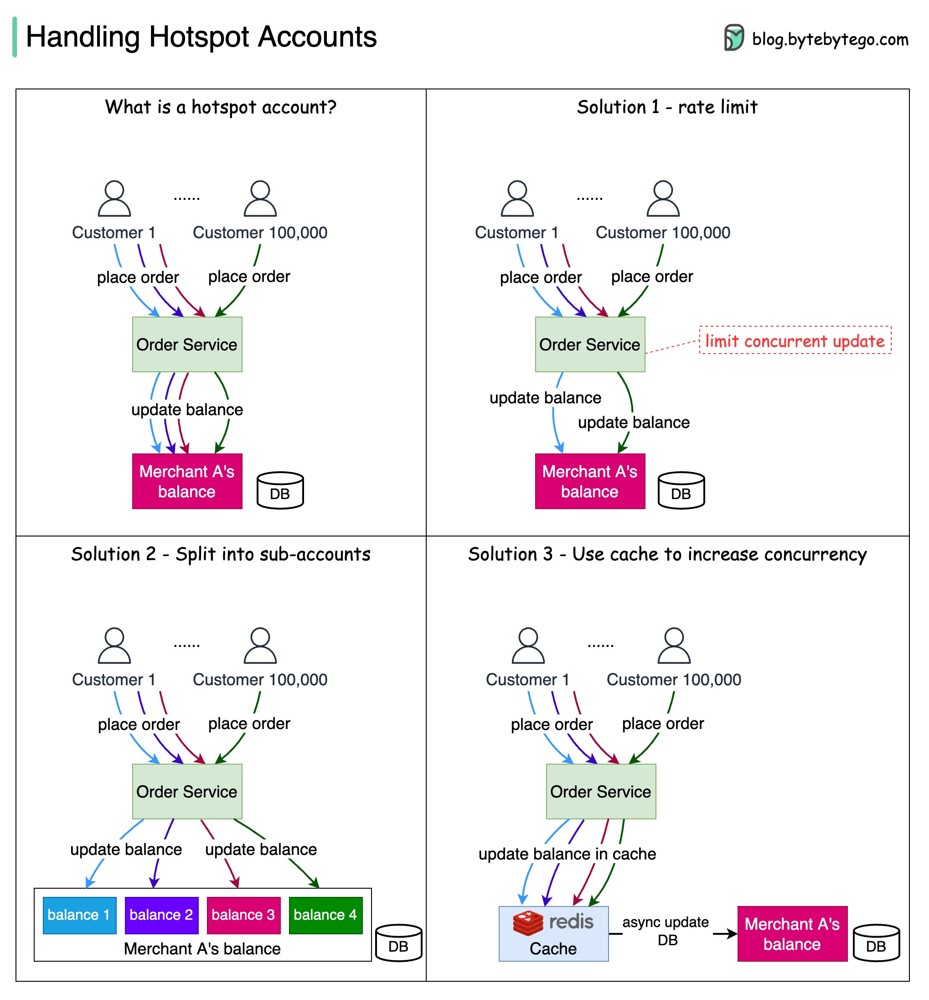

# 🔥 热点账户问题怎么解

> 大促时商家账户被疯狂更新，数据库扛不住怎么办？

Nike、宝洁等大商家在促销时，账户会成为支付系统的热点 👇

⚠️ **问题**
商家在Amazon Prime Day搞促销，大量并发订单同时更新商家余额。数据库行锁导致吞吐量低，成为瓶颈

✅ **三种优化方案**

1️⃣ **限流**
限制一定时间内的请求数，多余的拒绝或延迟重试。简单但用户体验差

2️⃣ **拆分子账户**
把商家账户拆成多个子账户，一次更新只锁一个子账户，其他子账户不受影响

3️⃣ **缓存先行**
用缓存层先更新余额，明细和余额异步写入数据库。内存缓存的吞吐量远高于数据库

💡 实际生产中通常组合使用：缓存先行+子账户拆分+限流兜底。

---

#支付系统 #热点账户 #系统设计 #后端开发 #程序员 #技术干货
