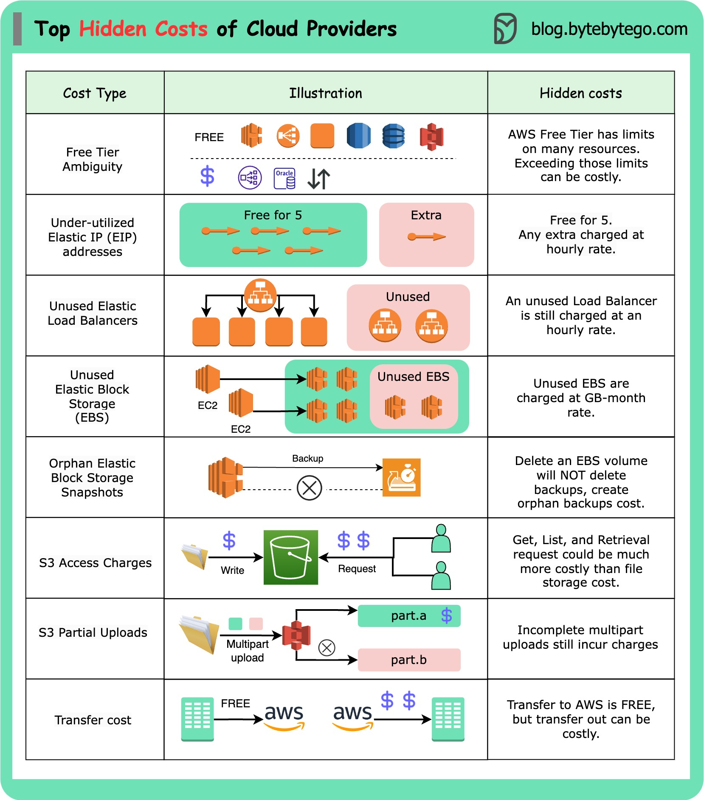

# 💸 云计算的隐藏成本！这些坑你踩过吗？

> 上云便宜？小心这些隐藏费用让你账单爆炸

云计算入门可能很便宜甚至免费，但复杂性往往带来隐藏成本 👇

⚠️ **常见隐藏成本（以AWS为例）**

📌 **免费套餐陷阱** — 三种免费类型，超出限制后费用可能比预期高

📌 **弹性IP** — 超过5个就按小时收费，而且是持续收费

📌 **负载均衡器** — 即使不活跃也按小时计费，数据传输另外收费

📌 **EBS存储** — 按GB/月计费，未使用的卷也收费

📌 **EBS快照** — 删除EBS卷不会自动删除快照，孤儿快照继续计费

📌 **S3访问费** — 存储便宜，但GET和LIST请求的费用可能超过存储费

📌 **S3分段上传** — 上传失败的部分仍然计费，需要手动清理

📌 **数据传输费** — 数据传入免费，传出很贵

💡 建议：设置账单告警、定期清理未使用资源、用AWS Cost Explorer分析费用。

---

#云计算 #AWS #成本优化 #程序员 #DevOps #技术干货
