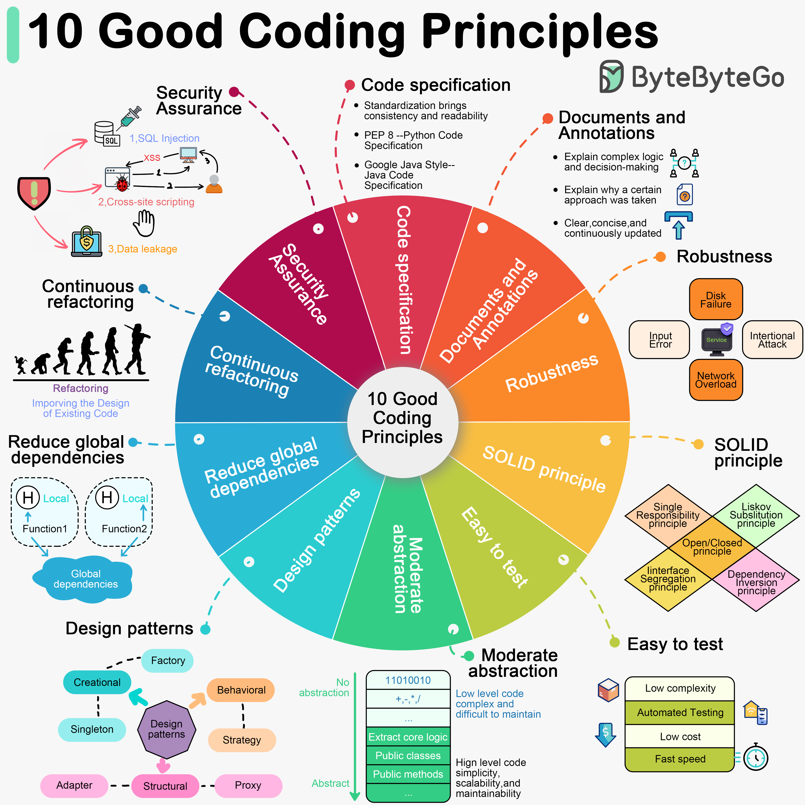

# ✨ 提升代码质量的10条黄金法则

> 好代码不是天生的，是靠这些原则练出来的

代码写得好不好，不只看能不能跑，更看能不能维护。这10条原则帮你写出高质量代码 👇

1️⃣ **遵循代码规范** — PEP 8、Google Java Style，团队统一规范是基础

2️⃣ **文档和注释** — 注释要解释"为什么"而不是"是什么"，保持简洁并持续更新

3️⃣ **健壮性** — 能优雅处理各种异常情况，不轻易崩溃

4️⃣ **遵循 SOLID 原则** — 单一职责、开闭原则、里氏替换、接口隔离、依赖倒置，可扩展代码的基石

5️⃣ **易于测试** — 降低组件复杂度，支持自动化测试

6️⃣ **适度抽象** — 提取核心逻辑隐藏复杂度，但别过度设计

7️⃣ **善用设计模式，但别滥用** — 每个模式都有适用场景，滥用反而增加复杂度

8️⃣ **减少全局依赖** — 用局部状态和参数传递，函数尽量无副作用

9️⃣ **持续重构** — 尽早发现和修复问题，减少技术债务

🔟 **安全第一** — 避免常见安全漏洞，安全意识贯穿始终

💡 不需要一次全做到，从最薄弱的环节开始改进，代码质量会越来越好。

---

#程序员 #代码质量 #编程 #软件开发 #SOLID #设计模式 #重构 #技术干货
