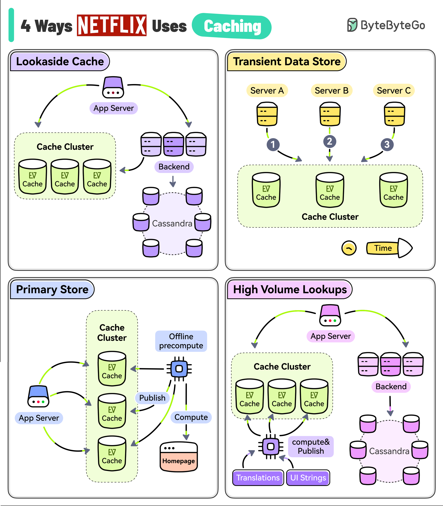

# 🎬 Netflix留住用户的秘密武器：4种缓存策略揭秘

> 用户注意力只有90秒，Netflix靠缓存抢时间

Netflix的目标是让你一直看下去，但用户的注意力只有90秒。他们用EVCache（分布式键值存储）来降低延迟，留住用户 👇

1️⃣ **旁路缓存（Lookaside Cache）**
应用先查EVCache，没命中再去后端服务和Cassandra取数据，同时更新缓存供下次使用

2️⃣ **临时数据存储（Transient Data Store）**
用EVCache存储播放会话等临时数据。一个服务开始会话，另一个更新，最后关闭，全程用缓存串联

3️⃣ **主存储（Primary Store）**
每晚运行大规模预计算，为每个用户的每个档案生成全新首页。数据写入EVCache，在线服务直接从缓存读取构建页面

4️⃣ **高流量数据（High Volume Data）**
UI文案、多语言翻译等高访问量数据，异步计算后发布到EVCache，保证低延迟和高可用

💡 Netflix的缓存不只是"加速"，而是整个架构的核心组件。缓存用得好，用户体验差不了。

---

#Netflix #缓存 #系统设计 #后端开发 #程序员 #技术干货 #架构
