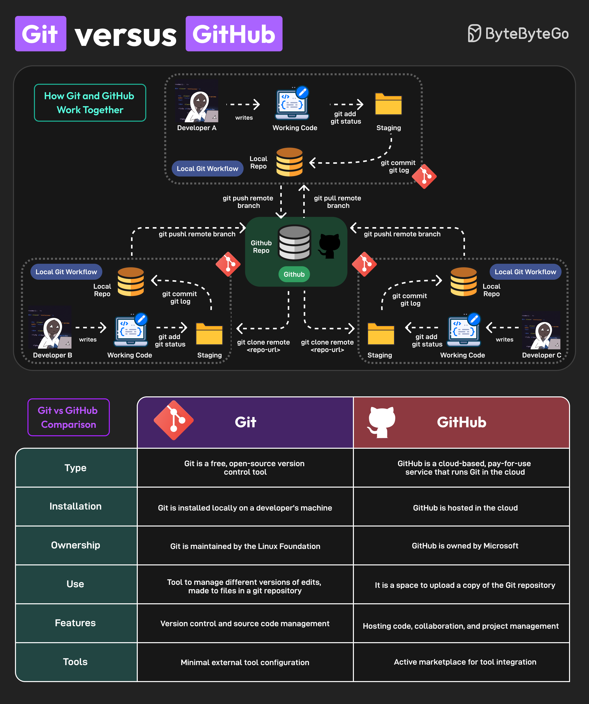

# 🆚 Git vs GitHub！它们不是一回事

> 很多新手分不清Git和GitHub，一次讲明白

Git和GitHub经常被混淆，但它们是不同的东西 👇

📌 **Git**
- 免费开源的版本控制工具
- 安装在本地开发机器上
- Linux基金会维护
- 管理文件的不同版本
- 支持版本控制和源码管理

📌 **GitHub**
- 云端付费服务，运行Git
- 托管在云端
- 微软所有
- 上传Git仓库的副本
- 代码托管、协作、项目管理

🔑 **核心区别**
- 你可以不用GitHub但用Git
- 你不能不用Git而用GitHub

💡 简单理解：Git是工具，GitHub是平台。Git管理代码版本，GitHub让你和别人协作。

---

#Git #GitHub #版本控制 #程序员 #开发工具 #技术干货
