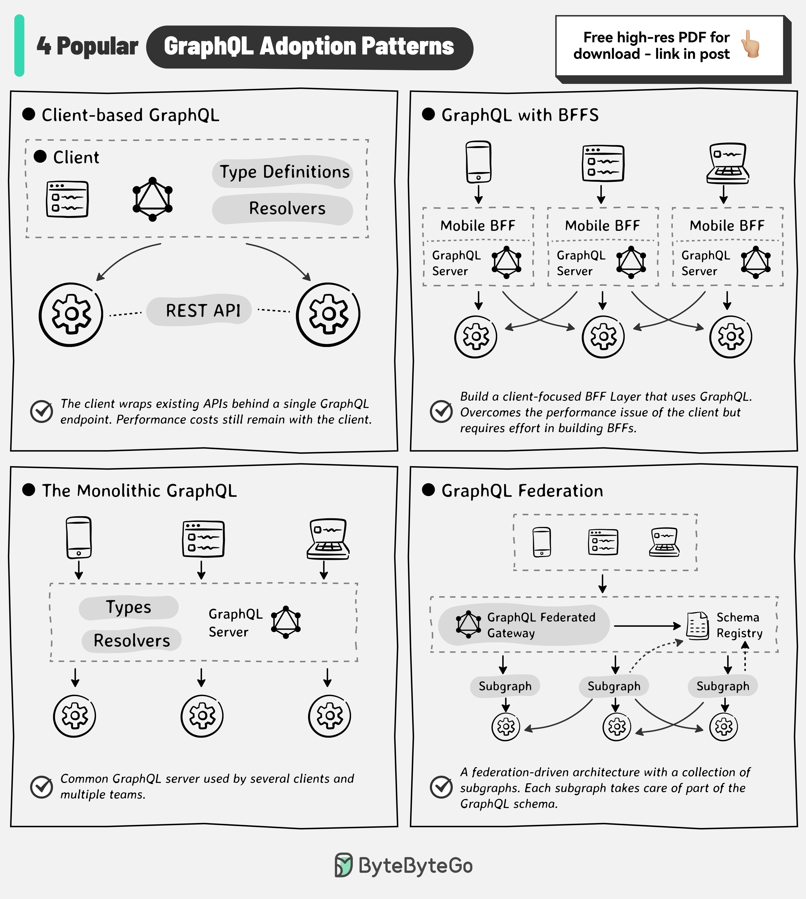

# 🔗 GraphQL的4种采用模式！选对适合你团队的

> 从简单到复杂，GraphQL有多种架构方案

团队通常从基础架构开始GraphQL之旅，但有多种模式可选 👇

1️⃣ **客户端GraphQL**
客户端把现有API包装在单个GraphQL端点后面。改善开发体验，但客户端仍承担数据聚合的性能成本

2️⃣ **GraphQL + BFF**
每个客户端有专属的BFF（Backend-for-Frontend）服务。GraphQL天然适合构建面向客户端的中间层。性能和体验提升，但要维护BFF

3️⃣ **单体GraphQL**
多个团队共享一个GraphQL服务器代码库，或一个团队拥有的GraphQL API被多个客户端团队使用

4️⃣ **GraphQL联邦**
多个子图合并成一个超级图。联邦网关负责路由请求到下游子图服务。数据归属权留在领域团队，避免重复工作

💡 大多数团队从模式1或3开始，随着规模增长再迁移到联邦模式。

---

#GraphQL #API #后端开发 #程序员 #系统架构 #技术干货
