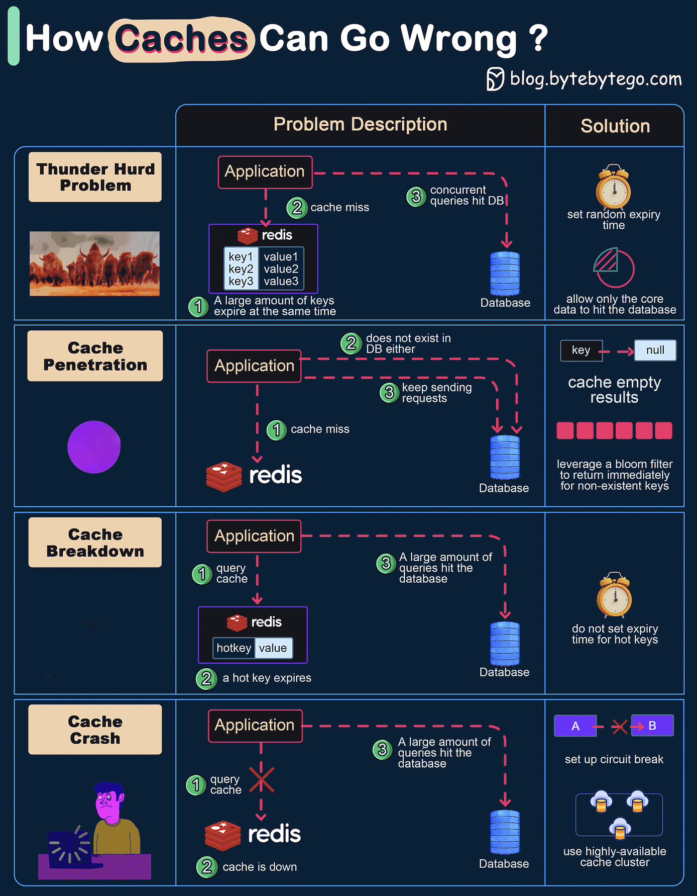

# ⚠️ 缓存系统的4大故障场景！附解决方案

> 缓存用不好比不用还糟糕

缓存出问题的4种典型场景及解决方案 👇

1️⃣ **缓存雪崩（Thunder Herd）**
大量key同时过期，请求直接打到数据库
✅ 过期时间加随机数 + 核心数据优先

2️⃣ **缓存穿透（Penetration）**
key在缓存和数据库都不存在，每次都打到数据库
✅ 缓存空值（短TTL）+ 布隆过滤器

3️⃣ **缓存击穿（Breakdown）**
热点key过期，大量请求打到数据库
✅ 热点key不设过期时间

4️⃣ **缓存宕机（Crash）**
缓存挂了，所有请求打到数据库
✅ 熔断器 + 缓存集群提高可用性

💡 面试高频题：雪崩、穿透、击穿的区别。记住：雪崩是批量过期，穿透是查不存在的数据，击穿是热点key过期。

---

#缓存 #Redis #系统设计 #后端开发 #程序员 #面试 #技术干货
