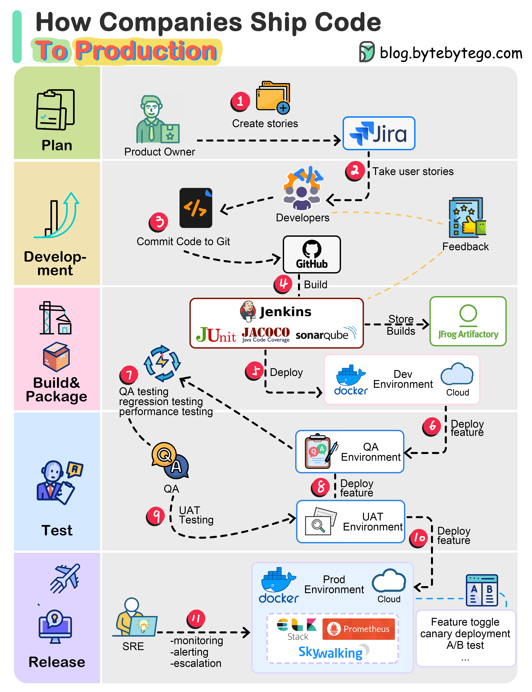

# 🚀 企业是怎么把代码发布到生产环境的？完整流程

> 从用户故事到生产监控，10步完成代码交付

一个典型的企业代码发布流程 👇

1️⃣ 产品经理根据需求创建用户故事
2️⃣ 开发团队从Backlog中取出故事放入两周的Sprint
3️⃣ 开发者提交代码到Git
4️⃣ Jenkins触发构建：单元测试+代码覆盖率+SonarQube质量门
5️⃣ 构建成功后存入制品库，部署到开发环境
6️⃣ 多个团队的功能独立测试，部署到QA1、QA2
7️⃣ QA团队执行功能测试、回归测试、性能测试
8️⃣ QA通过后部署到UAT环境
9️⃣ UAT通过后成为发布候选，按计划部署到生产
🔟 SRE团队负责生产监控

💡 这个流程的核心是"质量门"——每一步都有检查点，确保问题尽早发现。

---

#发布流程 #DevOps #CICD #程序员 #软件开发 #技术干货
