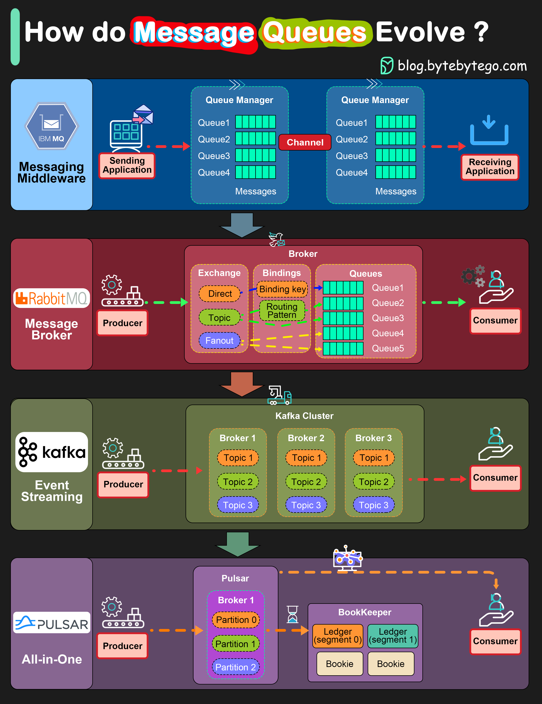

# 📨 消息队列进化史！IBM MQ → RabbitMQ → Kafka → Pulsar

> 30年进化，从企业级到云原生

消息队列架构的四代进化 👇

📌 **IBM MQ（1993）** — 金融行业广泛使用，2020年收入仍达10亿美元

📌 **RabbitMQ** — 生产者发布消息到Exchange，支持direct/topic/fanout三种路由模式

📌 **Kafka（2011）** — LinkedIn开源，优化写入，高吞吐低延迟，互联网公司标配

📌 **Pulsar** — Yahoo开发，消息+流处理一体化平台。服务层和持久层分离，更云原生，支持分层存储（S3）

💡 选择建议：传统企业用RabbitMQ，互联网公司用Kafka，云原生场景可以考虑Pulsar。

---

#消息队列 #Kafka #RabbitMQ #分布式系统 #程序员 #技术干货
