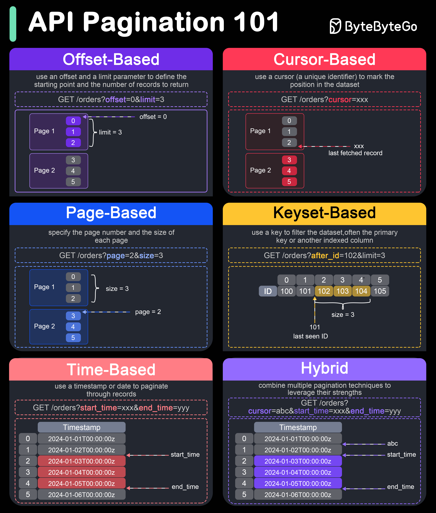

# 📄 API分页的6种方式！选对方式性能差10倍

> 大数据集不分页，接口直接卡死

6种常用的API分页技术 👇

1️⃣ **偏移分页** — ?offset=0&limit=3。简单但大偏移量时效率低

2️⃣ **游标分页** — ?cursor=xxx。大数据集更高效，不需要扫描跳过的记录

3️⃣ **页码分页** — ?page=2&size=3。易用但大页码时有性能问题

4️⃣ **键集分页** — ?after_id=102&limit=3。高效，避免大偏移量问题，但需要唯一索引键

5️⃣ **时间分页** — ?start_time=xxx&end_time=yyy。适合按时间排序的数据

6️⃣ **混合分页** — 组合多种技术，如游标+时间分页。最灵活但实现最复杂

💡 推荐：简单场景用页码分页，大数据集用游标分页，时序数据用时间分页。

---

#API #分页 #后端开发 #程序员 #系统设计 #技术干货
