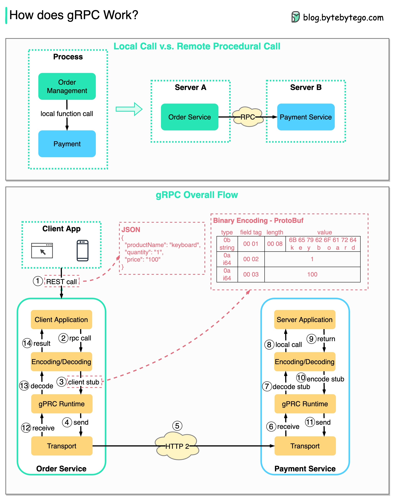

# ⚡ gRPC是怎么工作的？比JSON快5倍的秘密

> 微服务间通信的高性能选择

gRPC的完整数据流 👇

1️⃣ 客户端发起REST调用（JSON格式）
2️⃣-4️⃣ 订单服务（gRPC客户端）转换请求，编码为二进制格式发送到传输层
5️⃣ 通过HTTP/2发送数据包。二进制编码+网络优化，gRPC比JSON快5倍
6️⃣-8️⃣ 支付服务（gRPC服务端）接收、解码、调用服务端应用
9️⃣-1️⃣1️⃣ 结果编码后返回
1️⃣2️⃣-1️⃣4️⃣ 订单服务解码结果返回给客户端

💡 gRPC快的原因：Protocol Buffers二进制编码（比JSON小）+ HTTP/2多路复用。适合微服务内部通信。

---

#gRPC #微服务 #API #后端开发 #程序员 #技术干货
