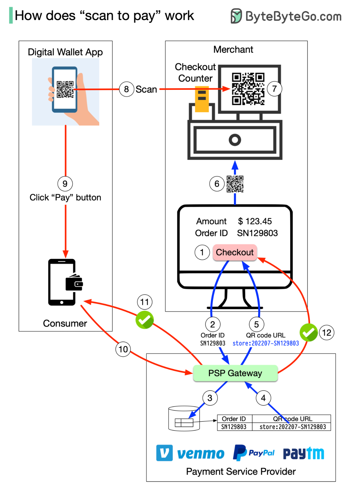

# 📱 扫码支付的完整流程！从生成二维码到支付成功

> 7步生成二维码 + 5步完成支付

扫码支付分两个子流程 👇

📌 **生成二维码（7步，不到1秒）**
1. 收银员计算总金额，点击结账
2. 收银机发送订单ID和金额到PSP
3. PSP保存信息，生成二维码URL
4-5. 支付网关读取并返回二维码URL
6-7. 收银台显示二维码

📌 **消费者扫码支付（5步）**
1. 打开数字钱包App扫码
2. 确认金额，点击支付
3. App通知PSP已支付
4. PSP标记二维码为已支付，返回成功给消费者
5. PSP通知商家支付成功

💡 整个流程涉及：商家系统、PSP（支付服务提供商）、数字钱包三方协作。

---

#扫码支付 #支付 #二维码 #金融科技 #程序员 #技术干货
