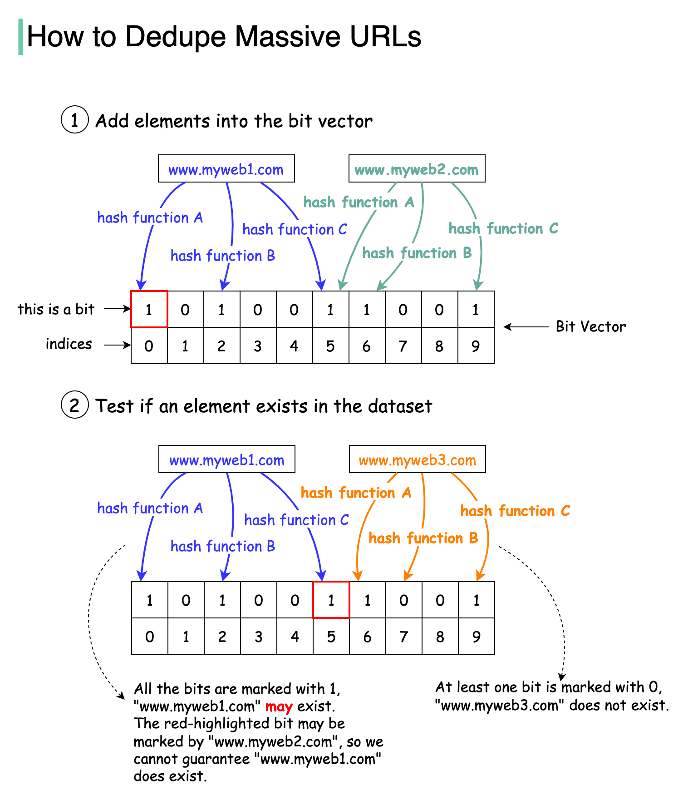

# 🔍 Google规模下如何避免爬取重复URL？布隆过滤器

> 50亿URL去重，Set太占内存，数据库太慢

三种方案对比 👇

❌ **Set** — 快但不省空间
❌ **数据库** — 能用但负载太高
✅ **布隆过滤器** — 首选方案

📌 **布隆过滤器原理**
- 基于位向量的概率数据结构
- 返回false = 元素一定不存在
- 返回true = 元素可能存在（有误判）
- 不会漏判（false negative不存在）

📌 **工作流程**
1. 添加URL：经过3个哈希函数，设置对应位为1
2. 查询URL：3个位都为1则可能存在，任一位为0则一定不存在

📌 **常用哈希函数**
RedisBloom和Spark用murmur，InfluxDB用xxhash

💡 布隆过滤器用极少的内存实现海量数据的去重判断，是大规模系统的利器。

---

#布隆过滤器 #算法 #爬虫 #系统设计 #程序员 #技术干货
