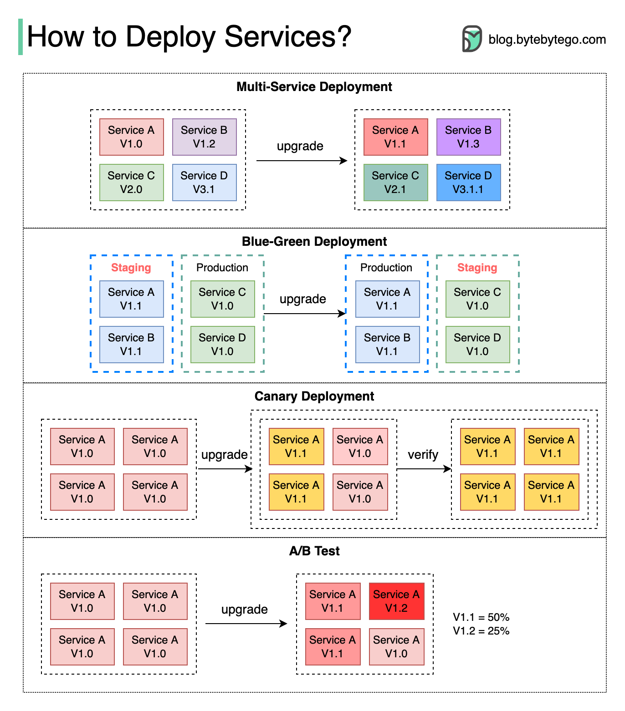

# 🚀 4种部署策略对比！蓝绿、金丝雀、A/B测试

> 部署有风险，选对策略降低风险

4种常用的部署策略 👇

1️⃣ **多服务同时部署** — 简单但难以管理依赖，回滚困难

2️⃣ **蓝绿部署** — 两套相同环境，测试通过后切换流量。回滚简单但成本高（两套环境）

3️⃣ **金丝雀部署** — 逐步升级，每次只影响部分用户。成本低、易回滚，但需要在生产环境测试

4️⃣ **A/B测试** — 不同版本同时运行，各服务一部分用户。成本低，适合测试新功能

💡 推荐：小团队用蓝绿部署，大团队用金丝雀部署。A/B测试适合验证产品假设。

---

#部署策略 #DevOps #蓝绿部署 #金丝雀 #程序员 #技术干货
