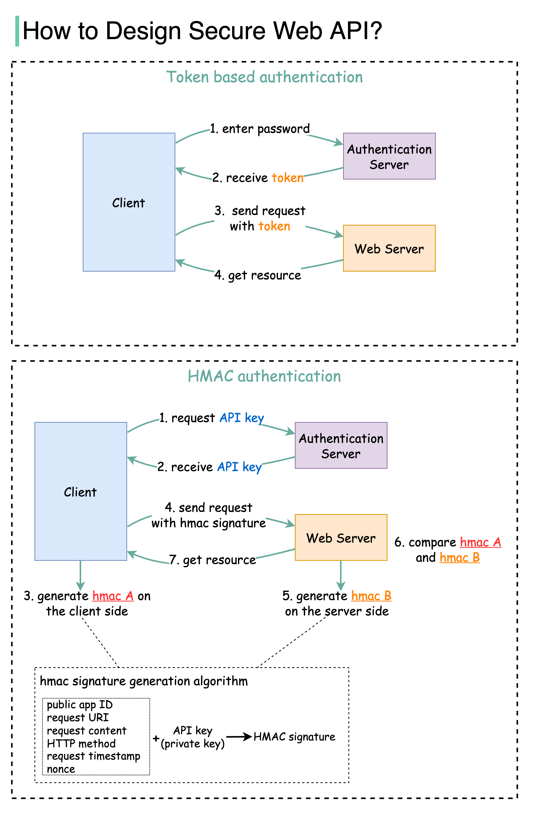

# 🔐 Web API安全访问设计！Token vs HMAC两种方案

> 每个API调用都必须经过认证

两种常见的API认证方式 👇

📌 **Token认证**
1. 用户发送密码到认证服务器
2. 服务器验证后生成带过期时间的Token
3-4. 客户端在HTTP Header中携带Token访问资源

📌 **HMAC认证**
1-2. 服务器生成公钥（APP ID）和私钥（API Key）
3. 客户端用私钥+请求属性生成签名（hmac A）
4. 请求中携带hmac A
5. 服务端用存储的API Key生成签名（hmac B）
6-7. 比较hmac A和hmac B，匹配则返回资源

💡 Token方案简单适合大多数场景，HMAC方案更安全适合对安全要求高的API。

---

#API安全 #认证 #HMAC #Token #程序员 #后端开发 #技术干货
