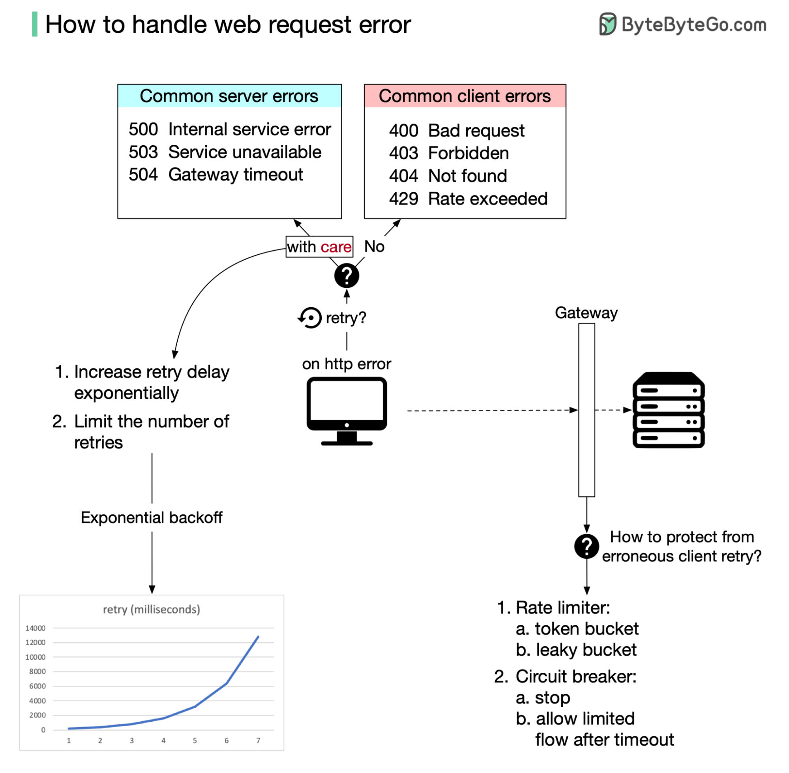

# ⚠️ Web请求错误处理！客户端和服务端各有招

> 4xx不重试，5xx小心重试

HTTP错误的正确处理方式 👇

📌 **客户端规则**
- 4xx错误：不要重试（客户端的问题）
- 5xx错误：小心重试

📌 **客户端：指数退避**
- 两次重试之间的延迟指数增长
- 限制最大重试次数

📌 **服务端：流量控制网关**
- 限流器（Rate Limiter）：令牌桶或漏桶算法
- 熔断器（Circuit Breaker）：错误超过阈值时立即停止HTTP流量，恢复后逐步放行

💡 客户端用指数退避+服务端用流量控制网关，可以有效处理间歇性错误。

---

#错误处理 #限流 #熔断器 #后端开发 #程序员 #技术干货
