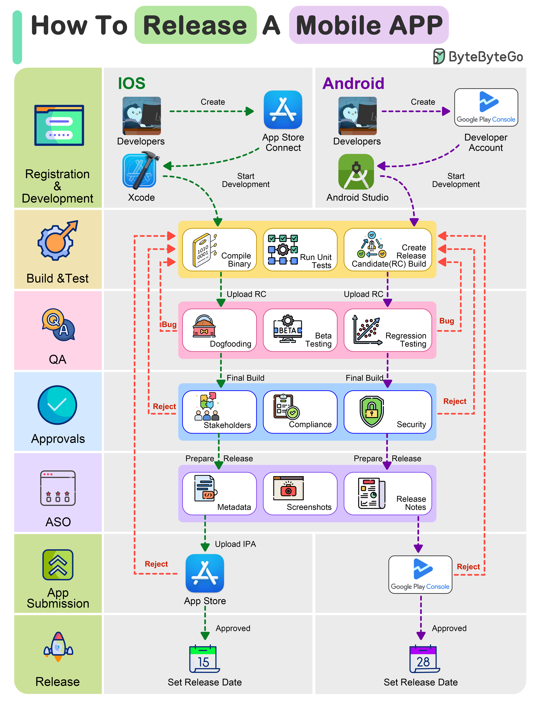

# 📱 移动App发布全流程！从开发到上架7步走

> iOS和Android发布流程一次搞懂

移动App发布的7个阶段 👇

1️⃣ **注册和开发** — 注册Apple Developer Program和Google Play Console，用平台工具开发

2️⃣ **构建和测试** — 编译二进制文件，全面测试功能和性能

3️⃣ **QA** — 内部测试（dogfooding）→ Beta测试 → 回归测试

4️⃣ **内部审批** — 利益相关者审批、应用商店合规、安全审批

5️⃣ **ASO优化** — 优化标题/描述/关键词、设计截图和图标、准备更新说明

6️⃣ **提交商店** — 通过App Store Connect和Google Play Console提交

7️⃣ **发布** — 审核通过后设定发布日期

💡 iOS审核通常比Android严格，预留足够的审核时间。

---

#移动开发 #iOS #Android #App发布 #程序员 #技术干货
