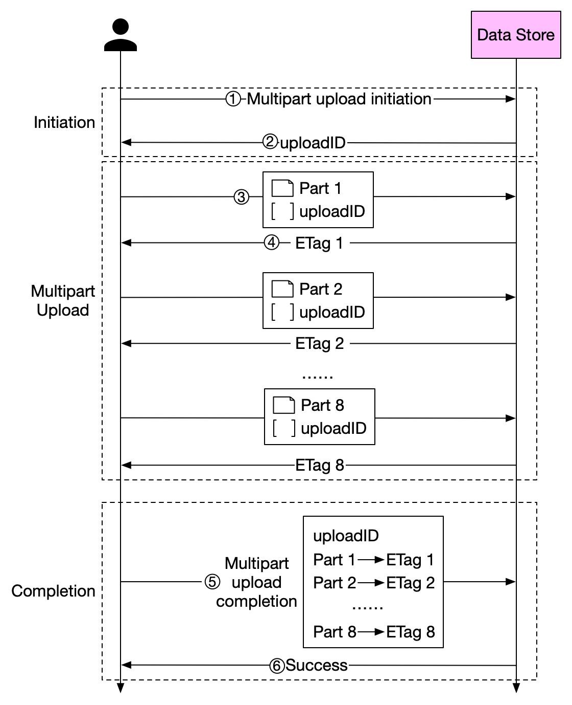

# 📦 大文件上传S3太慢？分片上传了解一下！

> 一张图搞懂 Multipart Upload 的完整流程

上传几个GB的大文件到S3，直接传？网络一断就得从头来，太痛苦了 😭

正确姿势是 **分片上传（Multipart Upload）**，来看看怎么玩 👇

📌 **第1步 - 发起上传**
客户端告诉S3："我要开始传大文件了"，S3返回一个唯一的 uploadID

📌 **第2步 - 切片上传**
把1.6GB的文件切成8份，每份200MB，带着 uploadID 逐个上传

📌 **第3步 - 校验确认**
每上传完一片，S3返回一个 **ETag**（MD5校验和），用来验证数据完整性

📌 **第4步 - 合并组装**
所有分片传完后，客户端发送完成请求（带上 uploadID + 分片号 + ETag），S3自动拼装还原文件 ✅

💡 **为什么要用分片上传？**
- 网络中断只需重传失败的那一片，不用从头来
- 可以并行上传多个分片，速度更快
- 支持断点续传，大文件传输更可靠

你们项目里传大文件用的什么方案？评论区聊聊 👇

---

#S3 #对象存储 #文件上传 #分片上传 #后端开发 #云存储 #系统设计
