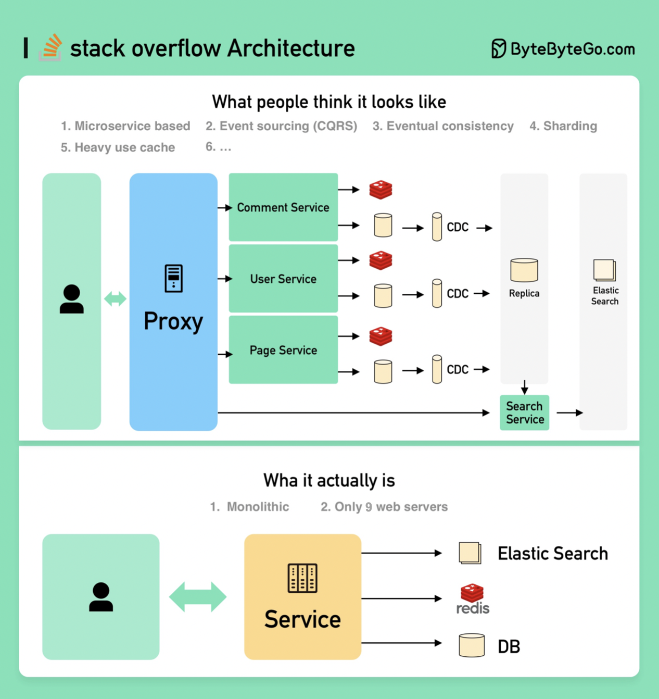

# 🤯 Stack Overflow 的架构竟然是单体应用？！

> 面试答微服务可能翻车，人家真实架构完全不一样

面试官问你"怎么设计 Stack Overflow"，你是不是准备了一套微服务大礼包？

❌ **面试官期望的答案：**
- 微服务拆分
- 每个服务独立数据库 + 重度缓存
- 服务间用消息队列异步通信
- Event Sourcing + CQRS
- 分布式一致性、CAP定理全上

✅ **实际的架构：**
Stack Overflow 用 **9台自建服务器** 扛住了所有流量，而且是 **单体架构**，不跑在云上！

这完全颠覆了我们的认知 😱

💡 **启示：**
- 不是所有系统都需要微服务
- 架构选型要看实际场景，不要盲目追新
- 单体架构优化到位，性能一样能打
- 过度设计比设计不足更可怕

所以下次面试，记得问清楚面试官想听"理想方案"还是"真实方案" 😏

你觉得单体和微服务哪个更适合你的项目？👇

---

#系统设计 #StackOverflow #架构设计 #微服务 #单体架构 #面试 #后端
