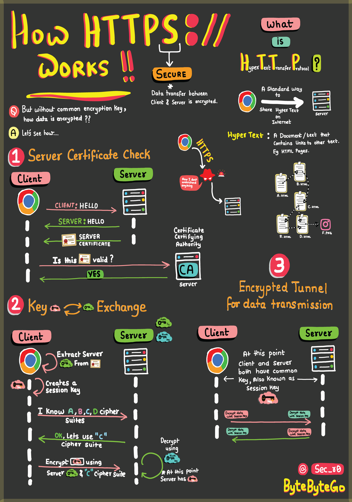

# 🔐 HTTPS加密全过程！SSL握手到底在干嘛？

> 用最简单的方式搞懂HTTPS、SSL握手和数据加密

每次打开网站看到那个小锁🔒，背后到底发生了什么？

📌 **HTTPS 是什么？**
就是给 HTTP 穿上了一层加密铠甲，防止数据在传输过程中被偷看或篡改

📌 **SSL/TLS 握手过程**
浏览器和服务器在正式通信前，要先"握个手"：
- 客户端发起连接，告诉服务器支持哪些加密方式
- 服务器返回数字证书（证明"我是真的"）
- 双方协商出一个对称密钥
- 后续通信全部用这个密钥加密

📌 **数据加密传输**
握手完成后，数据就在加密隧道里传输，即使被截获也是一堆乱码

📌 **HTML 和超文本**
HTTPS 里的 "HT" 就是 HyperText（超文本），HTML 负责组织网页内容，超链接把整个互联网串联起来

💡 **简单记：**
- HTTP = 明信片（谁都能看）
- HTTPS = 密封信（只有收件人能看）

你知道 TLS 1.2 和 1.3 的区别吗？评论区聊聊 👇

---

#HTTPS #SSL #加密 #网络安全 #Web开发 #面试 #程序员
