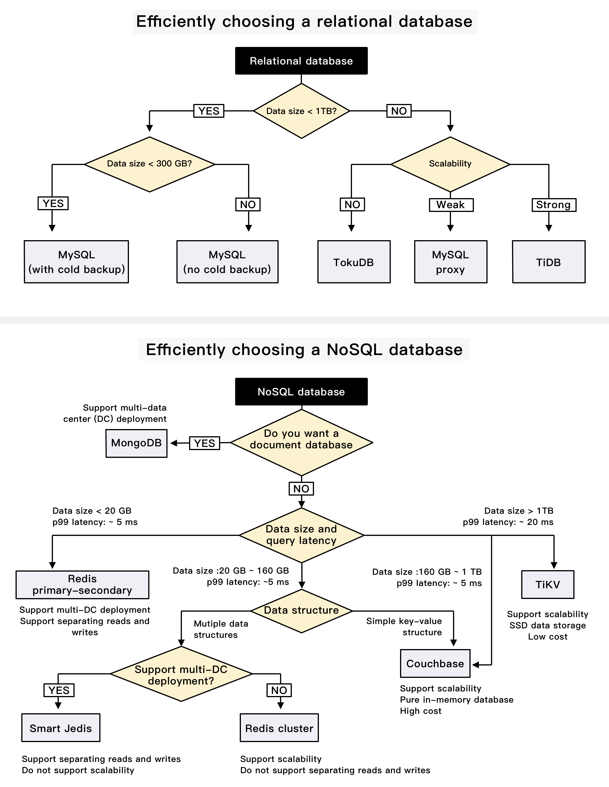

# 🎬 爱奇艺是怎么选数据库的？5亿月活背后的选型决策树

> 一张图看懂大厂数据库选型思路

爱奇艺，全球最大的在线视频网站之一，月活超过 **5亿**。这么大的体量，数据库怎么选？👇

📌 **用到的数据库：**
- **MySQL** — 关系型数据库的主力
- **Redis** — 缓存之王
- **TiDB** — HTAP分布式数据库，事务+分析两手抓
- **Couchbase** — 分布式NoSQL文档数据库
- **TokuDB** — MySQL的高性能存储引擎
- **Hive / Impala** — 大数据分析
- **MongoDB / HiGraph / TiKV** — 其他场景补充

📌 **选型思路：**
不是一个数据库打天下，而是根据业务场景走决策树：
- 需要事务？→ 关系型
- 需要高并发读？→ 缓存
- 需要海量存储？→ NoSQL
- 需要实时分析？→ HTAP

💡 大厂的数据库选型从来不是"哪个火用哪个"，而是根据数据特征、访问模式、一致性要求来决策。

你们公司用的什么数据库组合？👇

---

#数据库 #爱奇艺 #MySQL #Redis #TiDB #系统设计 #后端 #架构
