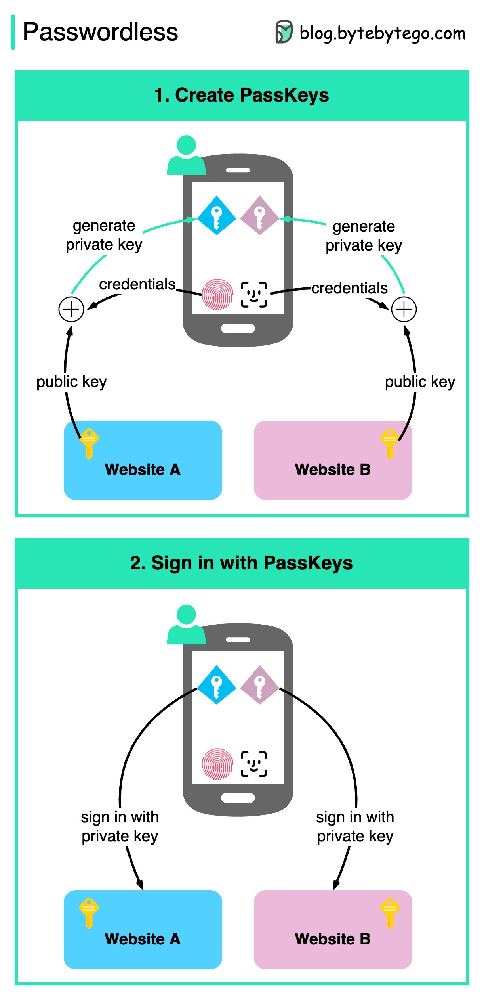

# 🔑 再见密码！Passkey无密码登录时代来了

> Google、Apple、Microsoft 联手推动的下一代认证方式

密码泄露、撞库攻击……密码这东西真的太不安全了。**Passkey** 就是来终结密码的 👇

📌 **Passkey 是什么？**
一种基于公私钥的认证方式，用 Face ID / Touch ID / 指纹 代替密码登录

📌 **注册流程：**
1. 确认账户信息
2. 用生物识别（面容/指纹）验证身份
3. 设备生成一对密钥：私钥存本地，公钥给网站

📌 **登录流程：**
1. 选择账户
2. 用生物识别解锁私钥
3. 私钥签名验证，登录成功 ✅

📌 **为什么更安全？**
- 网站数据库里 **不存密码**，泄露了也没事
- 私钥只在你的设备上，别人拿不到
- 不怕钓鱼攻击，因为 Passkey 绑定了域名

📌 **跨平台支持**
基于行业标准，Windows、macOS、iOS、ChromeOS、Android 全支持，体验统一

💡 密码的时代正在终结，Passkey 是未来。你试过 Passkey 登录吗？

---

#Passkey #无密码 #认证 #安全 #FaceID #Google #Apple #程序员
