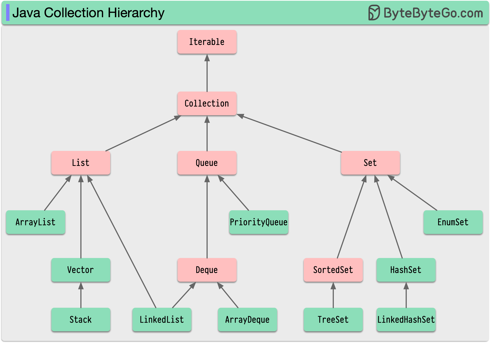

# ☕ Java集合框架全景图！一张图搞定面试高频考点

> List、Set、Map、Queue 的关系一目了然

Java 工程师绕不开的 **集合框架（JCF）**，面试必考，开发必用 👇

📌 **核心接口**
- **Collection** — 所有集合的根接口，支持增删查
- 继承了 **Iterable**，可以用 for-each 遍历

📌 **三大子接口：**

🔹 **List** — 有序、可重复
- ArrayList、LinkedList、Vector

🔹 **Set** — 无序、不重复
- HashSet、TreeSet、LinkedHashSet

🔹 **Queue** — 队列，先进先出
- PriorityQueue、ArrayDeque

📌 **Map（独立体系）**
- 键值对存储，Key不重复
- HashMap、TreeMap、LinkedHashMap、ConcurrentHashMap

💡 **选型建议：**
- 需要随机访问 → ArrayList
- 频繁插入删除 → LinkedList
- 去重 → HashSet
- 排序 → TreeSet / TreeMap
- 线程安全 → ConcurrentHashMap

掌握集合框架的层次关系，选对数据结构，代码效率直接翻倍。

你面试被问过哪些集合相关的问题？👇

---

#Java #集合框架 #数据结构 #面试 #后端 #编程 #程序员
