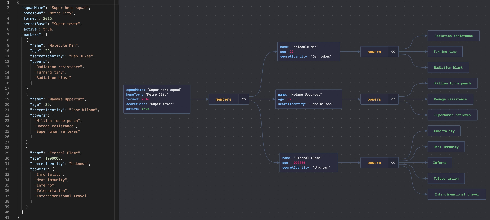

# 🧩 嵌套JSON看到头晕？这个工具帮你可视化！

> JSON Crack：把复杂JSON变成直观的图形

嵌套了好几层的 JSON 文件，看着就头大 😵‍💫

**JSON Crack** 可以把 JSON 文件自动生成图形化的节点关系图，层次结构一目了然

📌 **能干什么？**
- 把 JSON 数据转成可视化图表
- 嵌套再深也能清晰展示
- 支持在线使用，拖进去就能看

💡 处理复杂 API 响应、配置文件的时候特别好用。收藏备用。

你还有什么好用的 JSON 工具推荐？👇

---

#JSON #开发工具 #效率工具 #程序员 #前端 #后端 #可视化
