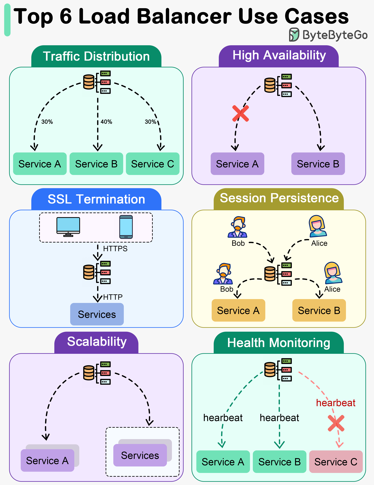

# ⚖️ 负载均衡器的6大核心用途！不只是分发流量

> 一张图看懂负载均衡器在架构中的关键角色

负载均衡器不只是把请求分到不同服务器，它能做的事情比你想的多 👇

📌 **流量分发**
把请求均匀分配到多台服务器，防止单台过载，保证性能和可用性

📌 **高可用**
自动把流量从故障服务器切到健康服务器，服务不中断 🔄

📌 **SSL卸载**
把 SSL/TLS 加解密的活从后端服务器接过来，减轻后端负担，提升整体性能 🔐

📌 **会话保持**
确保同一用户的后续请求都打到同一台服务器，维持会话状态

📌 **弹性扩展**
新增服务器加入池子，负载均衡器自动分配流量，水平扩展轻松搞定 📈

📌 **健康检查**
持续监控服务器状态，发现异常自动摘除，保证服务质量

💡 负载均衡器是高可用架构的基石，几乎所有生产环境都离不开它。

你们用的是哪种负载均衡器？Nginx？ALB？HAProxy？👇

---

#负载均衡 #系统设计 #高可用 #架构 #后端 #运维 #面试
