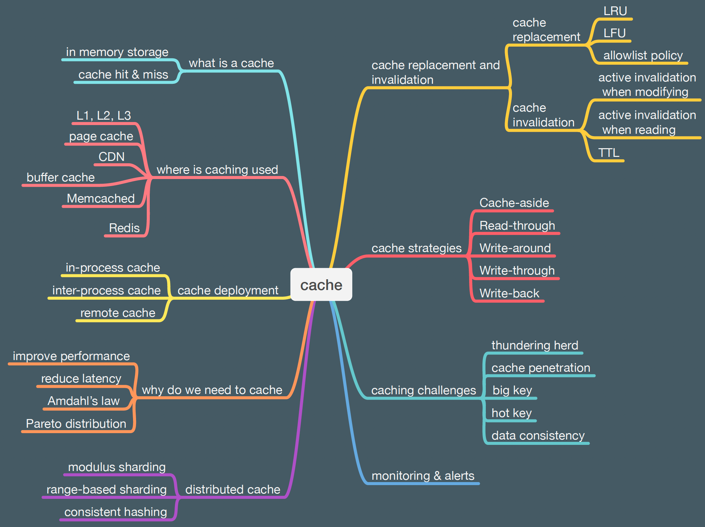

# 💾 缓存知识全景图！从入门到精通一张图搞定

> 什么是缓存、为什么要用、怎么用、有什么坑？

缓存是系统设计中最重要的优化手段之一，这张图覆盖了你需要知道的一切 👇

📌 **基础概念**
- 什么是缓存？
- 为什么需要缓存？
- 缓存用在哪里？

📌 **部署方式**
- 本地缓存 vs 分布式缓存
- 缓存集群的部署架构

📌 **缓存策略**
- Cache Aside / Read Through / Write Through / Write Behind
- 不同策略适合不同场景

📌 **淘汰与失效**
- LRU、LFU、FIFO 等淘汰算法
- 缓存过期和主动失效

📌 **常见挑战**
- 缓存穿透、缓存雪崩、缓存击穿
- 数据一致性问题

💡 缓存用好了是性能利器，用不好就是 bug 制造机。建议收藏这张图反复看。

你在缓存上踩过最大的坑是什么？👇

---

#缓存 #Redis #系统设计 #后端 #性能优化 #架构 #面试
