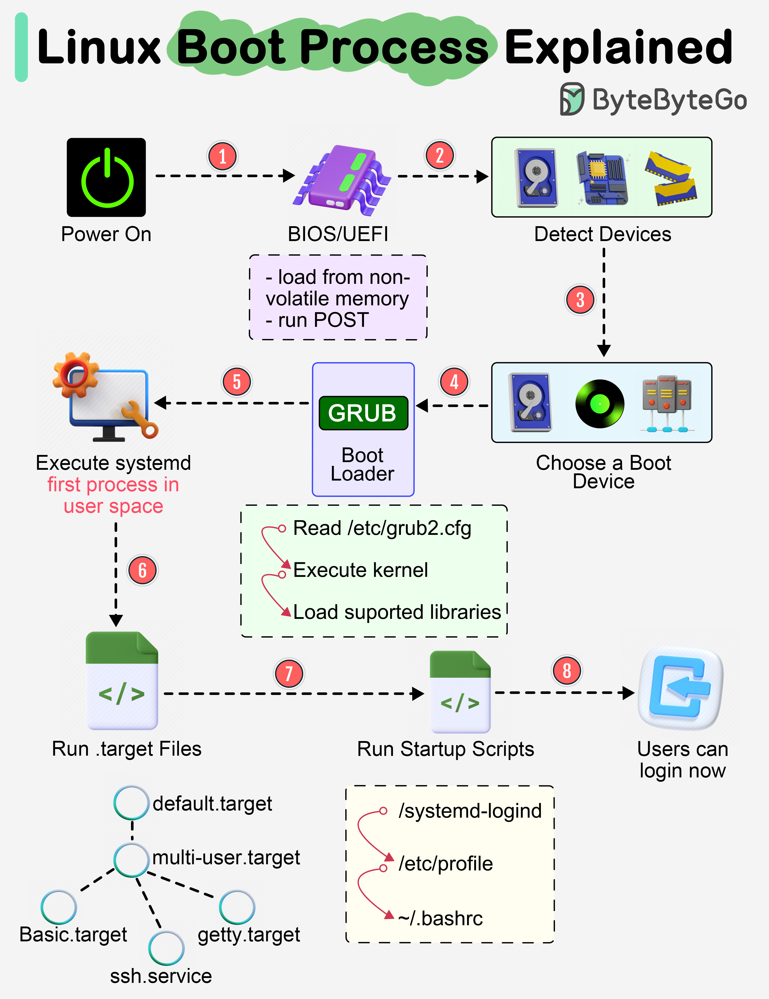

# 🖥️ Linux开机到底发生了什么？8步启动流程详解

> 从按下电源键到登录界面，一张图全搞懂

用了这么久 Linux，你知道按下电源键后发生了什么吗？👇

📌 **Step 1** — 加电后，BIOS/UEFI 固件从非易失性存储加载，执行 POST（开机自检）
📌 **Step 2** — BIOS/UEFI 检测连接的设备：CPU、内存、存储等
📌 **Step 3** — 选择启动设备：硬盘、网络服务器或光驱
📌 **Step 4** — 运行引导加载器（GRUB），提供系统/内核选择菜单
📌 **Step 5** — 内核就绪后进入用户空间，启动 **systemd** 作为第一个用户进程，管理服务、挂载文件系统、启动桌面环境
📌 **Step 6** — systemd 激活默认的 target 单元，执行其他分析单元
📌 **Step 7** — 运行启动脚本，配置系统环境
📌 **Step 8** — 显示登录窗口，系统就绪 ✅

💡 了解启动流程对排查启动故障特别有帮助。下次系统起不来，你就知道该从哪一步开始排查了。

你遇到过 Linux 启动失败的情况吗？👇

---

#Linux #操作系统 #启动流程 #运维 #后端 #程序员 #面试
