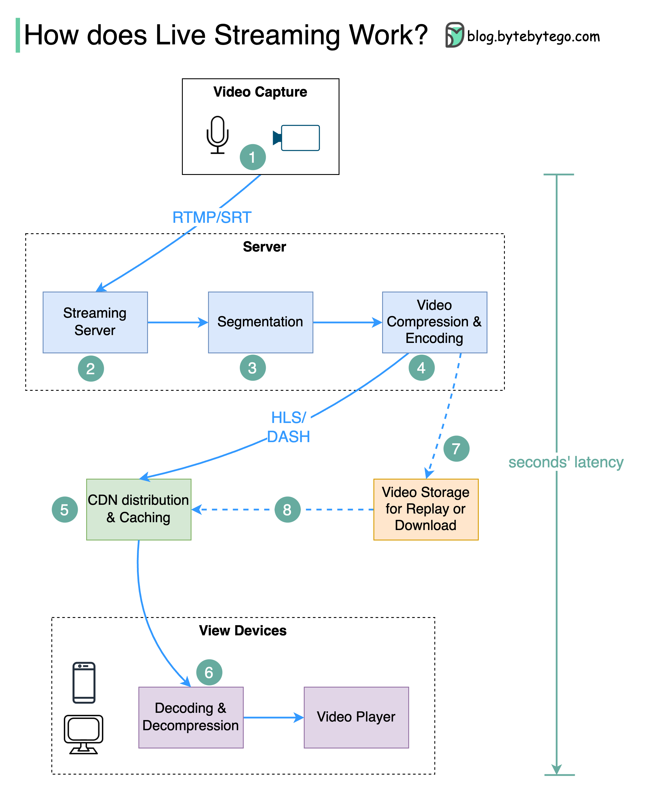

# 📺 直播是怎么实现的？从采集到播放全流程揭秘

> YouTube、TikTok、Twitch 背后的直播技术

刷直播的时候有没有想过，画面是怎么实时传到你手机上的？👇

📌 **Step 1 - 采集**
摄像头和麦克风采集原始视频音频数据，发送到服务端

📌 **Step 2 - 压缩编码**
分离背景和视频元素进行压缩，编码为 H.264 等标准格式，体积大幅缩小

📌 **Step 3 - 分片**
编码后的数据切成几秒一段的小片段，方便传输

📌 **Step 4 - 自适应码率**
为不同设备和网络条件生成多个码率版本，网好看高清，网差看流畅

📌 **Step 5 - CDN分发**
数据推送到全球各地的边缘节点，观众从最近的节点拉流，延迟极低

📌 **Step 6 - 解码播放**
观众设备解码解压，视频播放器渲染画面

📌 **Step 7-8 - 回放存储**
如果需要回放，编码数据同时存到存储服务器

📌 **主流协议：**
- **RTMP** — 推流常用
- **HLS** — Apple设备专用，自适应码率
- **DASH** — 不支持Apple，但也支持自适应码率

💡 直播的核心挑战就是低延迟 + 高并发，CDN 和自适应码率是关键。

你最常看哪个平台的直播？👇

---

#直播 #流媒体 #CDN #视频技术 #系统设计 #后端 #TikTok
