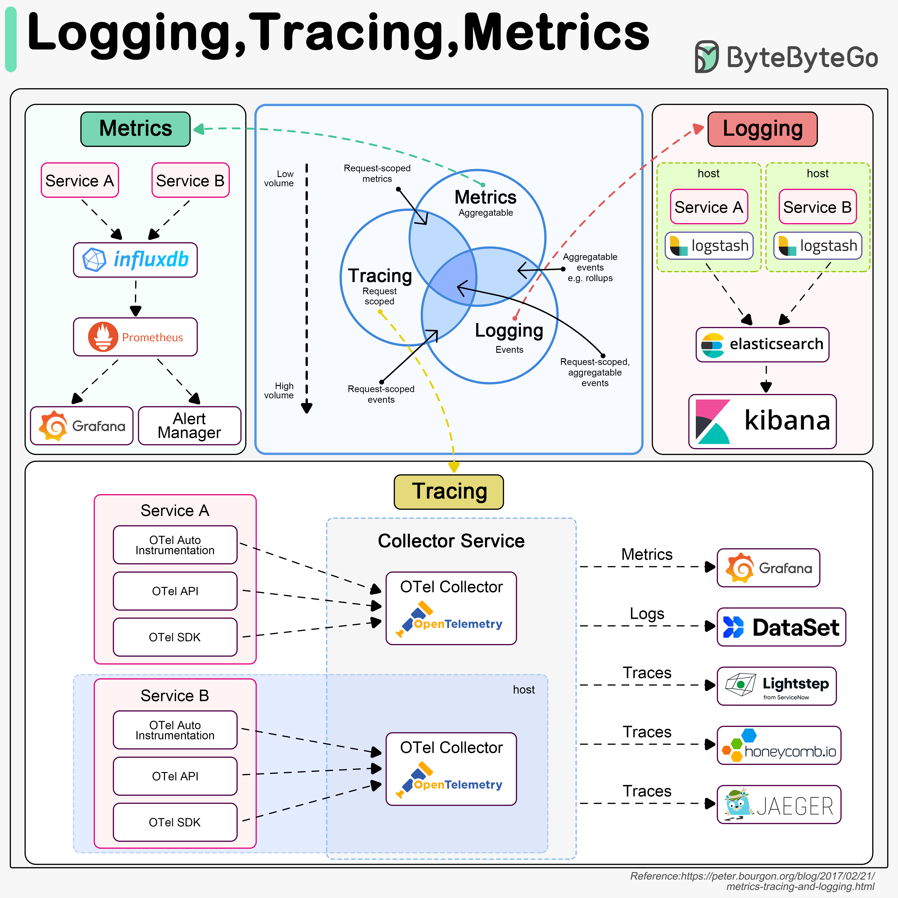

# 👁️ 可观测性三大支柱！日志、链路追踪、指标

> 系统出问题了怎么排查？靠这三样

系统可观测性的三大支柱，每个都不可或缺 👇

📌 **Logging（日志）**
- 记录系统中的离散事件（请求、数据库访问等）
- 数据量最大
- 常用 **ELK**（Elasticsearch + Logstash + Kibana）搭建日志平台
- 关键：统一日志格式，方便关键词搜索

📌 **Tracing（链路追踪）**
- 以请求为维度，追踪一个请求经过的所有服务
- 比如：API网关 → 负载均衡 → 服务A → 服务B → 数据库
- 用于定位系统瓶颈
- **OpenTelemetry** 统一了三大支柱的框架

📌 **Metrics（指标）**
- 系统的聚合信息：QPS、响应时间、延迟等
- 原始数据存 **InfluxDB** 等时序数据库
- **Prometheus** 拉取数据 + 告警规则
- **Grafana** 展示 + 告警管理器发送通知

💡 日志告诉你"发生了什么"，追踪告诉你"在哪里慢了"，指标告诉你"整体状态如何"。三者缺一不可。

你们的可观测性方案是怎么搭的？👇

---

#可观测性 #日志 #监控 #Prometheus #Grafana #DevOps #运维
