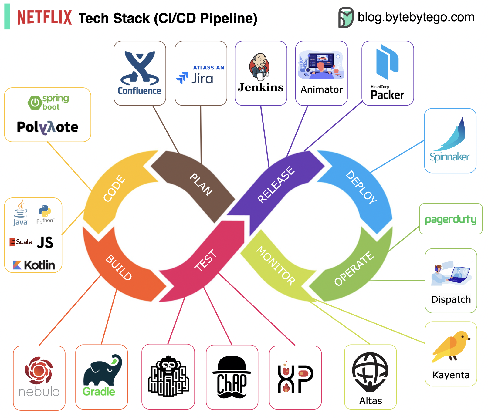

# 🎬 Netflix的CI/CD流水线长什么样？

> 从规划到上线，Netflix的DevOps全流程

Netflix 是怎么把代码从开发到上线的？来看看他们的 CI/CD 流水线 👇

📌 **规划** — JIRA 管项目，Confluence 写文档
📌 **编码** — 后端主力 Java，其他语言按场景选用
📌 **构建** — Gradle 为主，自研 Gradle 插件支持各种场景
📌 **打包** — 代码和依赖打包成 AMI（Amazon Machine Image）
📌 **测试** — 重视生产环境文化，自研混沌工程工具
📌 **部署** — 自研 **Spinnaker** 做金丝雀发布
📌 **监控** — **Atlas** 集中管理监控指标，**Kayenta** 检测异常
📌 **事件响应** — 按优先级分派，**PagerDuty** 处理告警

💡 Netflix 的 CI/CD 特点：大量自研工具 + 混沌工程文化 + 金丝雀发布。Spinnaker 后来还开源了，很多公司在用。

你们的 CI/CD 流水线是怎么搭的？👇

---

#Netflix #CICD #DevOps #Spinnaker #混沌工程 #后端 #架构
