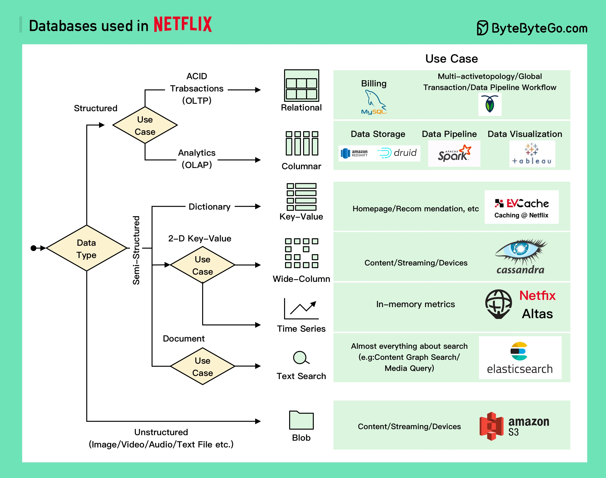

# 🎬 Netflix用了哪些数据库？6大类全覆盖

> 全球最大流媒体平台的数据库选型揭秘

Netflix 不是只用一种数据库，而是按场景选型，6大类全用上了 👇

📌 **关系型数据库**
- **MySQL** — 计费、订阅、税务、收入
- **CockroachDB** — 多区域主主架构、全局事务

📌 **列式数据库**
- **Redshift + Druid** — 结构化数据分析
- **Spark** — 数据管道处理
- **Tableau** — 数据可视化

📌 **KV数据库**
- **EVCache**（基于Memcached）— 用了10年+，缓存首页、个性化推荐等

📌 **宽列数据库**
- **Cassandra** — Netflix的默认选择，存视频/演员信息、用户数据、设备信息、观看历史

📌 **时序数据库**
- **Atlas** — 自研开源，存储和聚合监控指标

📌 **非结构化数据**
- **S3** — 默认选择，存图片/视频/指标/日志
- **Apache Iceberg** — 配合S3做大数据存储

💡 大厂的数据库选型从来不是一刀切，而是根据数据特征和访问模式精准匹配。

你从 Netflix 的选型中学到了什么？👇

---

#Netflix #数据库 #Cassandra #Redis #系统设计 #后端 #架构
