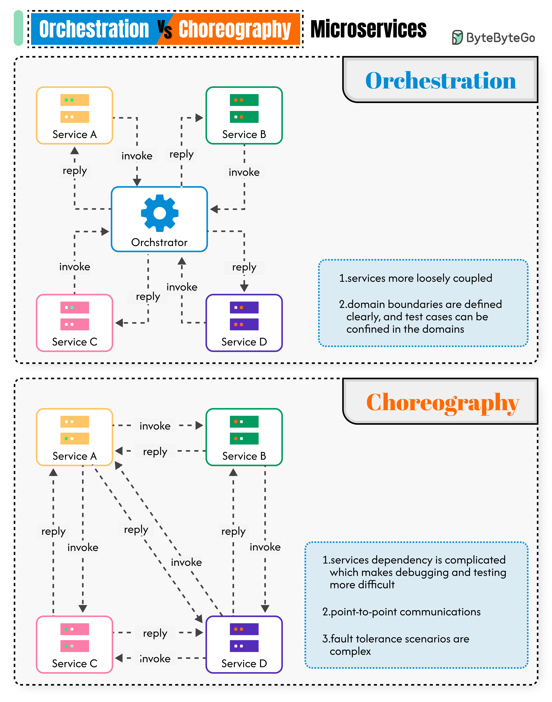

# 🎭 编排 vs 编舞！微服务协作的两种模式

> Orchestration 像指挥家，Choreography 像舞者自由配合

微服务之间怎么协作？两种方式 👇

📌 **编舞（Choreography）**
- 像舞蹈：编舞师定好规则，舞者们自行配合
- 服务之间点对点通信，通过事件驱动
- 去中心化，没有统一调度者

📌 **编排（Orchestration）**
- 像交响乐：指挥家统一调度所有乐手
- 有一个中心编排器，负责调用和组合服务
- 包含事务管理能力

📌 **编排的优势：**
- ✅ 可靠性 — 内置事务管理和错误处理
- ✅ 扩展性 — 加新服务只改编排器，不用改其他服务

📌 **编排的局限：**
- ⚠️ 性能 — 所有通信经过编排器，延迟更高
- ⚠️ 单点故障 — 编排器挂了全挂，需要高可用

💡 Netflix 的 Conductor 就是一个微服务编排器。实际项目中两种模式经常混合使用。

你们的微服务用的哪种协作方式？👇

---

#微服务 #编排 #架构 #系统设计 #后端 #事件驱动 #面试
