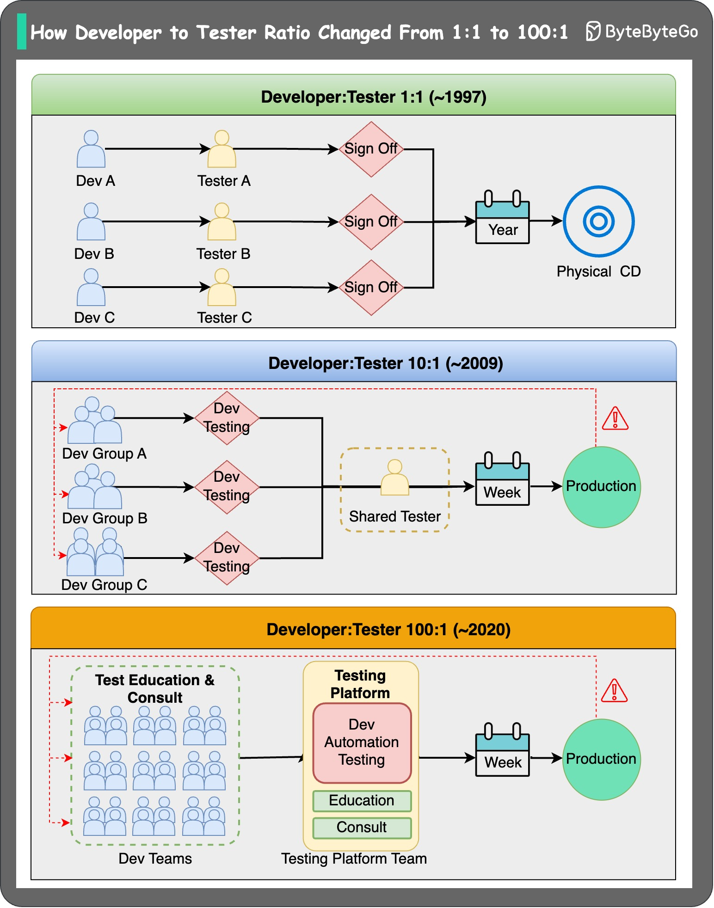

# 🔄 开发与测试比例从1:1变成100:1！测试去哪了？

> 25年间测试岗位的巨大变迁

你有没有发现，身边的测试工程师越来越少了？来看看这25年的变化 👇

📌 **1:1（~1997年）**
- 软件刻在光盘上交付，瀑布式开发
- 版本大约3年发一次
- Bug 一旦发布就永远存在
- 测试人员和开发人员一样多

📌 **10:1（~2009年）**
- 发布速度大幅提升，补丁几周内就能上线
- 敏捷开发兴起，迭代驱动
- Amazon 的 Web 服务主要由开发自己测试
- 测试资源被大幅压缩

📌 **100:1（~2020年）**
- Google、Microsoft 取消了 SDET/SETI 岗位
- Amazon 放缓了 SDET 招聘

📌 **怎么做到的？**
- 高度可扩展的 **标准化测试工具** 被广泛采用
- 开发自己写自动化测试
- 测试知识通过培训和咨询传播

💡 趋势很明确：测试左移，开发负责质量。自动化测试能力已经是开发的必备技能了。

你们团队的开发测试比例是多少？👇

---

#测试 #DevOps #自动化测试 #敏捷开发 #程序员 #软件工程 #面试
