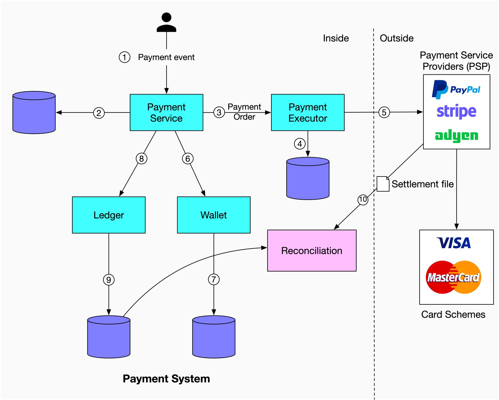

# 💳 点击"购买"后钱是怎么流转的？支付系统全流程

> 从下单到结算，支付系统的完整链路

在 Amazon 点了"Buy"按钮，背后发生了什么？👇

📌 **支付流程：**

1️⃣ 用户点击购买，生成支付事件，发送到支付服务
2️⃣ 支付服务把事件存入数据库
3️⃣ 一次支付可能包含多个订单（多个卖家），支付服务为每个订单调用支付执行器
4️⃣ 支付执行器把订单存入数据库
5️⃣ 支付执行器调用外部 **PSP（支付服务商）** 完成信用卡扣款
6️⃣ 扣款成功后，支付服务更新 **钱包**，记录卖家应得金额
7️⃣ 钱包服务把余额信息存入数据库
8️⃣ 钱包更新成功后，支付服务调用 **账本** 更新
9️⃣ 账本服务追加新的记账信息
🔟 每晚 PSP/银行发送 **结算文件**，包含当日所有交易和账户余额

💡 支付系统的核心：事件驱动 + 多步骤流转 + 每晚对账。数据一致性是最大的挑战。

你对支付系统的哪个环节最感兴趣？👇

---

#支付系统 #FinTech #系统设计 #后端 #架构 #电商 #面试
