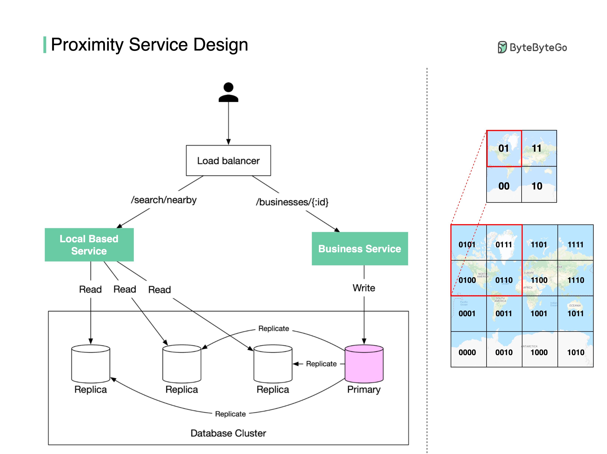

# 📍 "附近的餐厅"是怎么找到的？Geohash算法揭秘

> 大众点评、Google Maps 背后的位置服务设计

打开地图搜"附近的餐厅"，结果秒出。背后是怎么实现的？👇

📌 **两个核心服务：**
- **商家服务** — 增删改餐厅信息，展示详情
- **位置服务（LBS）** — 给定位置和半径，返回附近餐厅列表

📌 **难点在哪？**
如果直接存经纬度，每次查询都要计算你和所有餐厅的距离，效率极低

📌 **Geohash 算法来救场：**
1. 把地球按经纬度分成4个象限，用0/1编码
2. 递归细分，每个网格用交替的经度位和纬度位表示
3. 查询时只需：`SELECT * FROM geohash_index WHERE geohash LIKE '01%'`

📌 **Geohash 的局限：**
- 市中心一个格子里可能有上千家餐厅
- 海洋里一个格子可能一家都没有
- 所以实际还需要更复杂的优化算法（如四叉树）

💡 Geohash 是位置服务的基础算法，面试系统设计题经常考。

你用过哪些地图类应用？👇

---

#Geohash #位置服务 #系统设计 #地图 #算法 #后端 #面试
