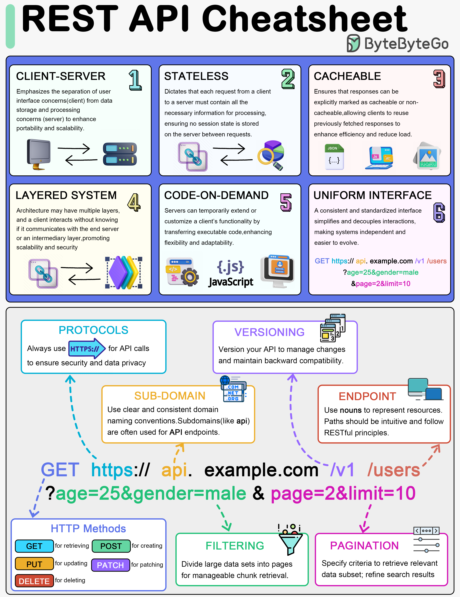

# 📋 REST API速查表！设计原则+实践要点一图搞定

> 6大原则、HTTP方法、分页、过滤……全覆盖

REST API 设计的核心知识点，一张图收录 👇

📌 **6大设计原则**
REST 架构的基础约束，理解了才能设计出规范的API

📌 **关键组件**
- HTTP方法（GET/POST/PUT/DELETE）
- 协议规范
- 版本管理
- 端点设计

📌 **实践要点**
- 分页（Pagination）
- 过滤（Filtering）
- 排序（Sorting）
- 错误处理

💡 不管你是刚入门还是想复习，这张速查表都值得收藏。设计API时翻出来对照一下。

你在API设计中踩过什么坑？👇

---

#RESTAPI #API设计 #后端 #Web开发 #HTTP #面试 #程序员
