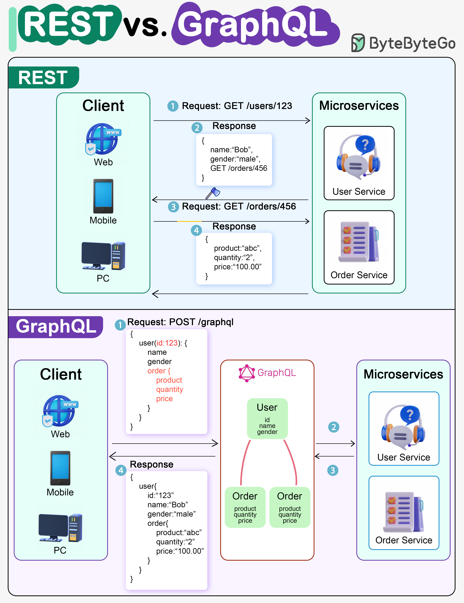

# ⚔️ REST vs GraphQL！到底该选哪个？

> 两种API设计方案的优劣对比

REST 和 GraphQL 各有千秋，怎么选？👇

📌 **REST**
- 用标准HTTP方法（GET/POST/PUT/DELETE）
- 接口简单统一，服务间通信友好
- 缓存策略简单直接
- ⚠️ 可能需要多次请求才能拼齐数据（多端点问题）

📌 **GraphQL**
- 单一端点，客户端精确指定需要的字段
- 嵌套查询，服务端返回优化后的数据
- 支持 Mutation（修改）和 Subscription（实时通知）
- 适合数据聚合和前端需求频繁变化的场景
- ⚠️ 复杂度转移到客户端，需要防范滥用查询
- ⚠️ 缓存比REST复杂

📌 **怎么选？**
- 前端需求复杂多变 → **GraphQL**
- 需要简单一致的接口 → **REST**
- 微服务间通信 → **REST**
- BFF（Backend for Frontend）→ **GraphQL**

你的项目用的哪个？👇

---

#REST #GraphQL #API #后端 #前端 #系统设计 #面试
