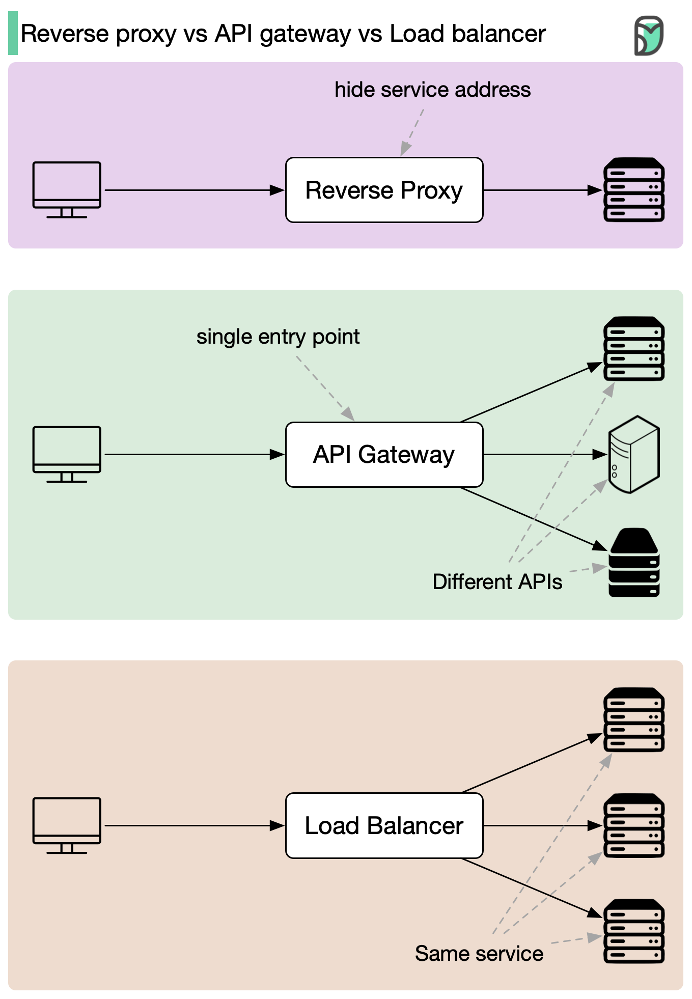

# 🦸 反向代理 vs API网关 vs 负载均衡器！三兄弟怎么分工？

> 三个超级英雄各有绝活，组队更强

这三个组件经常一起出现，但职责不同 👇

📌 **反向代理 — 隐身侠**
- 隐藏后端服务器，代为获取数据
- 保护敏感网站免受攻击
- 关键词：隐身、安全

📌 **API网关 — 邮递员**
- 把请求投递到正确的微服务
- 适合服务众多、互相通信频繁的应用
- 关键词：路由、聚合

📌 **负载均衡器 — 交警**
- 把流量均匀分配到各服务器，防止拥堵
- 高流量网站的必备组件
- 关键词：分流、均衡

📌 **怎么选？**
- 需要隐藏服务器 → 反向代理
- 需要统一管理微服务入口 → API网关
- 需要分发流量 → 负载均衡器
- 大多数情况 → **三个都要**，组队效果最佳

你的架构里用了哪几个？👇

---

#反向代理 #API网关 #负载均衡 #系统设计 #架构 #后端 #面试
