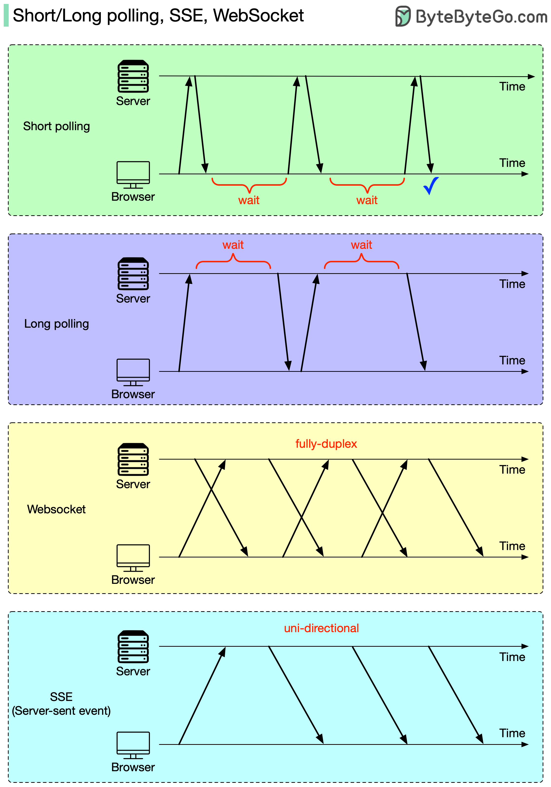

# 🔄 短轮询、长轮询、SSE、WebSocket！实时通信4种方案

> HTTP服务器不能主动推消息，怎么实现实时更新？

HTTP服务器没法主动给浏览器发消息，那怎么实现实时更新？4种方案 👇

📌 **短轮询（Short Polling）**
浏览器不停地问服务器："有新数据吗？"直到拿到最新数据。简单但浪费资源

📌 **长轮询（Long Polling）**
浏览器发请求，服务器 **hold住不返回**，直到有新数据才响应。比短轮询省资源

📌 **SSE（Server-Sent Events）**
连接建立后，服务器可以 **主动推送** 数据给浏览器。但是 **单向的**，浏览器不能发新请求

📌 **WebSocket**
连接建立后，**全双工通信**，浏览器和服务器都能随时发消息。最强大但也最复杂

💡 **怎么选？**
- 简单场景、兼容性优先 → 长轮询
- 服务端单向推送（如通知）→ SSE
- 双向实时通信（如聊天）→ WebSocket

你的项目用的哪种实时方案？👇

---

#WebSocket #SSE #轮询 #实时通信 #后端 #系统设计 #面试
