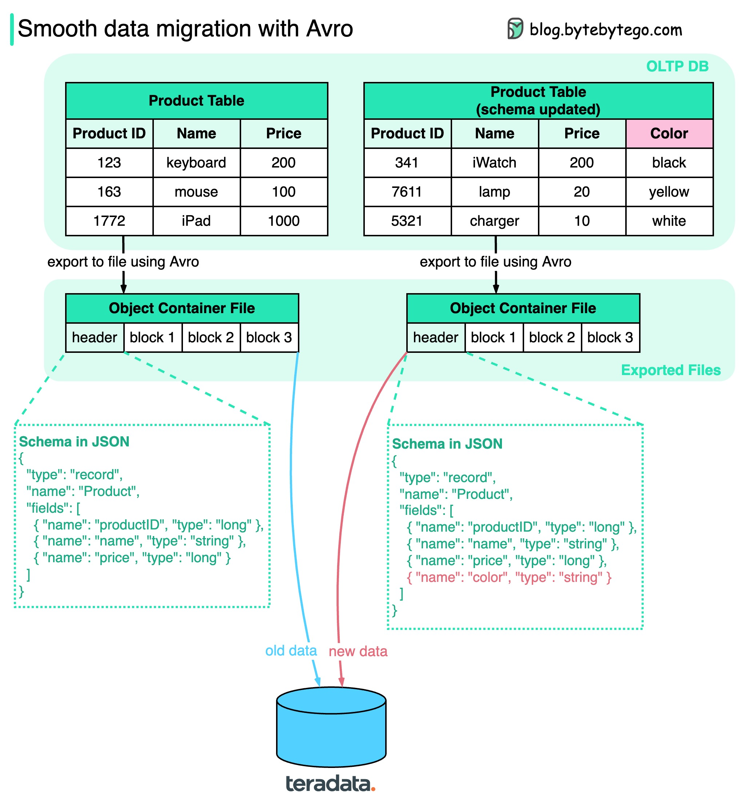

# 🔄 用Avro实现平滑数据迁移！Schema演进不再头疼

> 动态Schema管理，新旧数据无缝迁移

数据迁移最怕什么？Schema变了，旧数据读不了。**Apache Avro** 来解决这个问题 👇

📌 **Avro 是什么？**
2009年从 Hadoop 子项目起步，主要用于数据序列化和RPC

📌 **核心优势：**
- 数据导出到对象容器文件时，**Schema和数据存在一起**
- Avro **动态生成** Schema（不像gRPC/Thrift是静态生成）
- Schema变了？新Schema自动生成，和新数据一起存储

📌 **迁移流程：**
1. 导出数据到容器文件（Schema + 数据块）
2. 加载到新的数据存储（如Teradata）
3. 任何人都能读取Schema，知道怎么解析数据
4. 新旧数据都能成功迁移 ✅

💡 Avro 的动态Schema是它相比 gRPC/Thrift 在数据迁移场景下的最大优势。

你做过大规模数据迁移吗？用的什么方案？👇

---

#Avro #数据迁移 #Schema #大数据 #Hadoop #后端 #数据工程
