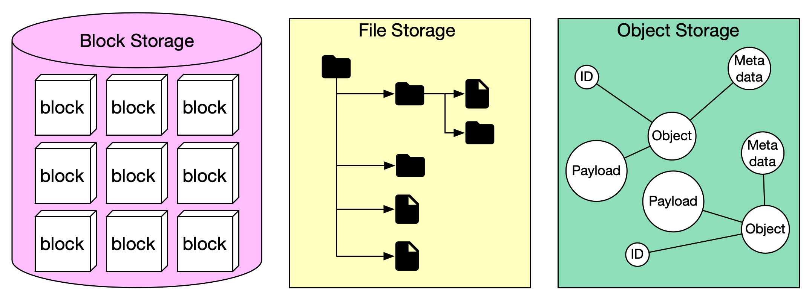

# 💾 三大存储系统对比！块存储、文件存储、对象存储

> 搞清楚区别，选型不再纠结

存储系统分三大类，各有各的定位 👇

📌 **块存储（Block Storage）**
- 最早出现（1960年代），HDD/SSD 都属于块存储
- 提供原始数据块，最灵活
- 可以格式化为文件系统，也可以直接被数据库/虚拟机管理
- 可通过网络连接（FC/iSCSI），但归单台服务器独占
- 性能最强

📌 **文件存储（File Storage）**
- 建立在块存储之上，提供文件和目录的抽象
- 层级目录结构，最通用
- 通过 SMB/NFS 协议共享给多台服务器
- 适合组织内大量文件共享

📌 **对象存储（Object Storage）**
- 最新出现，牺牲性能换取高持久性、大规模、低成本
- 扁平结构，没有目录层级
- 通过 RESTful API 访问
- 适合冷数据、归档、备份
- 代表：AWS S3、Google Cloud Storage、Azure Blob

💡 简单记：要性能选块存储，要共享选文件存储，要便宜大量存选对象存储。

你们项目用的哪种存储？👇

---

#存储 #S3 #块存储 #对象存储 #系统设计 #后端 #云计算
