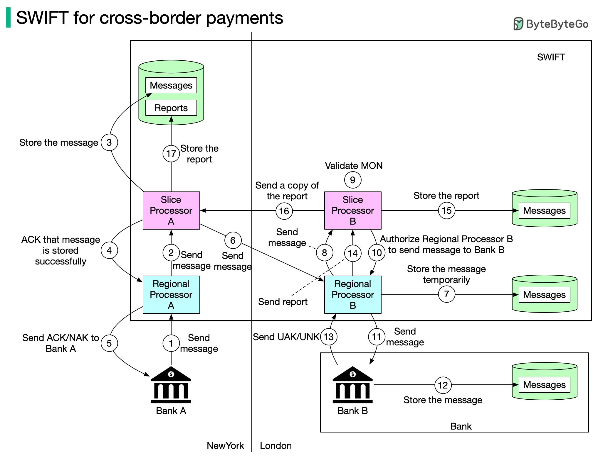

# 🏦 SWIFT跨境支付消息系统是怎么工作的？

> 全球银行间的安全通信网络，17步完成一笔跨境转账

SWIFT 是连接全球银行的安全消息系统，每天处理数百万条支付消息 👇

📌 **SWIFT 是什么？**
全称"环球银行金融电信协会"，总部在比利时，由成员银行共同运营。注意：SWIFT 传递的是 **消息**，不是资金本身

📌 **消息传递流程（纽约银行A → 伦敦银行B）：**

1️⃣ 银行A发送转账消息到纽约区域处理器
2️⃣ 区域处理器验证格式，发送到切片处理器A
3️⃣ 切片处理器A存储消息
4️⃣ 通知区域处理器消息已存储
5️⃣ 区域处理器发送ACK/NAK给银行A
6️⃣ 切片处理器A把消息发到伦敦区域处理器B
7️⃣-10️⃣ 伦敦端存储、验证、授权
1️⃣1️⃣ 区域处理器B把消息发给银行B
1️⃣2️⃣-1️⃣7️⃣ 银行B确认收到，生成报告，双方存档

💡 SWIFT 的设计核心：消息可靠传递 + 多层确认 + 完整审计追踪。

你对跨境支付感兴趣吗？👇

---

#SWIFT #跨境支付 #金融 #银行 #系统设计 #FinTech #架构
