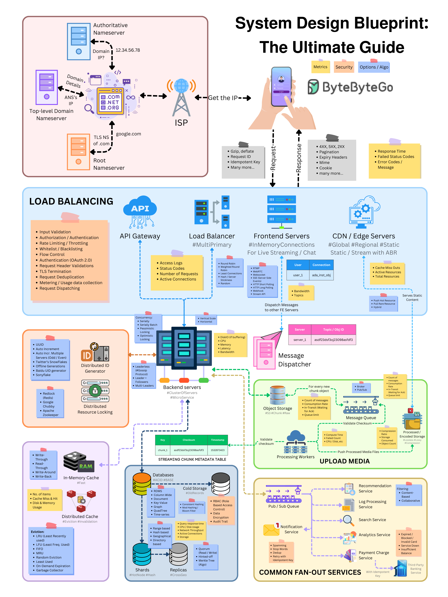

# 🗺️ 系统设计面试终极蓝图！一张图覆盖所有考点

> 面试前过一遍这张清单，心里就有底了

系统设计面试不知道聊什么？这张蓝图帮你理清思路 👇

📌 **核心讨论点：**
- 负载均衡
- API网关
- 通信协议
- CDN
- 数据库
- 缓存
- 消息队列
- 唯一ID生成
- 扩展性
- 可用性
- 性能
- 安全
- 容错与弹性
- ……

💡 面试时按这个清单逐项讨论，既全面又有条理。建议收藏，面试前翻出来过一遍。

你觉得系统设计面试最难的部分是什么？👇

---

#系统设计 #面试 #架构 #后端 #分布式 #程序员 #求职
