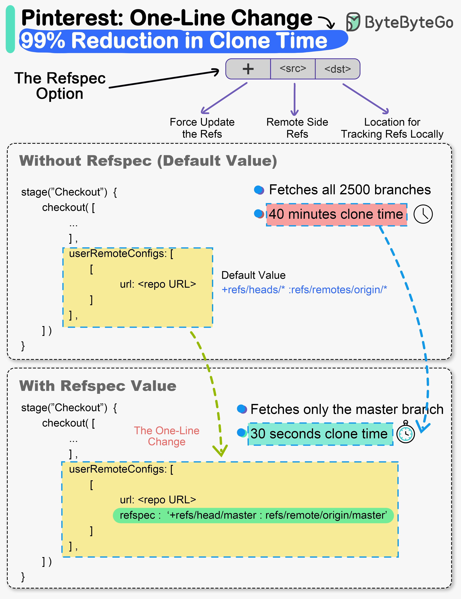

# ⚡ Pinterest一行代码改动，克隆时间从40分钟降到30秒！

> 小改动大影响，Git refspec 的威力

Pinterest 的工程效率团队只改了一行代码，构建速度提升了 99% 👇

📌 **背景：**
Pinterest 最大的 Monorepo "Pinboard"：
- 35万次提交
- 完整克隆 20GB
- 每个工作日 6万次 git pull

📌 **问题：**
Jenkins 构建流水线的 Checkout 阶段已经设置了浅克隆、不拉标签、只取最近50次提交。但还是要 **40分钟**

📌 **根因：**
没有设置 **Git refspec** 选项！Git 默认拉取所有 refspec，意味着每次构建都要拉取 **2500多个分支**

📌 **修复：**
加上 refspec 选项，指定只拉取 master 分支。就这一行改动。

📌 **结果：**
40分钟 → **30秒** 🚀

💡 性能优化不一定要大改架构，有时候一个被忽略的配置项就是瓶颈。

你遇到过类似的"一行代码解决大问题"的经历吗？👇

---

#Pinterest #Git #DevOps #性能优化 #CI/CD #Monorepo #程序员
