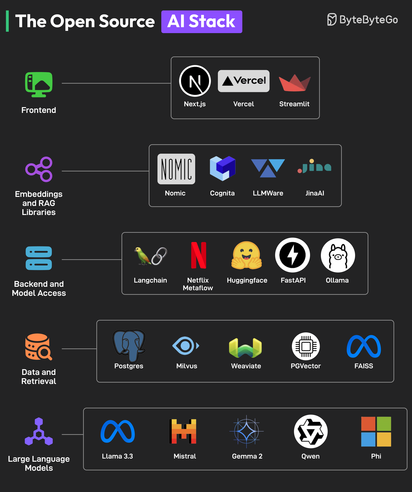

# 🤖 开源AI技术栈全景图！不花大钱也能搭AI应用

> 前端、后端、模型、数据……全用开源方案

搭建AI应用不一定要花大钱，开源生态已经非常成熟了 👇

📌 **前端** — NextJS、Streamlit 构建AI界面，Vercel 部署
📌 **Embedding & RAG** — Nomic、JinaAI、LLMAware 构建搜索和RAG功能
📌 **后端** — FastAPI、LangChain、Metaflow；Ollama、HuggingFace 访问模型
📌 **数据与检索** — Postgres、Milvus、Weaviate、PGVector、FAISS
📌 **大语言模型** — Llama、Mistral、Qwen、Phi、Gemma，性能不输商业模型

💡 开源AI生态正在快速演进，让AI开发变得人人可及。选对工具组合，小团队也能做出强大的AI应用。

你在用哪些开源AI工具？👇

---

#AI #开源 #LLM #LangChain #HuggingFace #RAG #程序员
