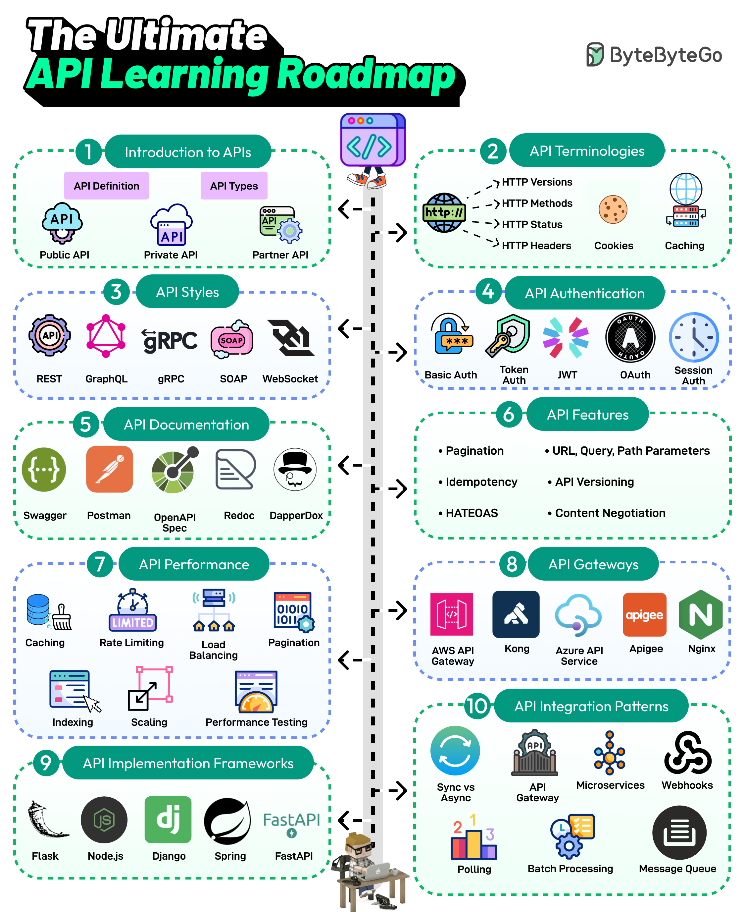

# 🗺️ API学习路线图！从入门到精通的完整指南

> 每个开发者都需要掌握的API知识体系

API 是互联网通信的骨架，这张路线图覆盖了最重要的知识点 👇

📌 **API基础** — 公共API、私有API、合作伙伴API
📌 **核心术语** — HTTP版本、Cookie、缓存
📌 **API风格** — REST、SOAP、GraphQL、gRPC、WebSocket
📌 **认证方式** — Basic Auth、Token、JWT、OAuth、Session
📌 **API文档** — Swagger、Postman、Redoc
📌 **关键特性** — 分页、幂等性、版本管理、HATEOAS
📌 **性能优化** — 缓存、限流、负载均衡、数据库索引
📌 **API网关** — Amazon API Gateway、Kong、Nginx
📌 **开发框架** — Node.js、Spring、Flask、Django、FastAPI
📌 **集成模式** — 网关、事件驱动、Webhook、轮询、批处理

💡 按这个路线图学习，API相关的知识就不会有盲区了。建议收藏。

你在API学习中遇到的最大挑战是什么？👇

---

#API #学习路线 #REST #GraphQL #后端 #程序员 #面试
