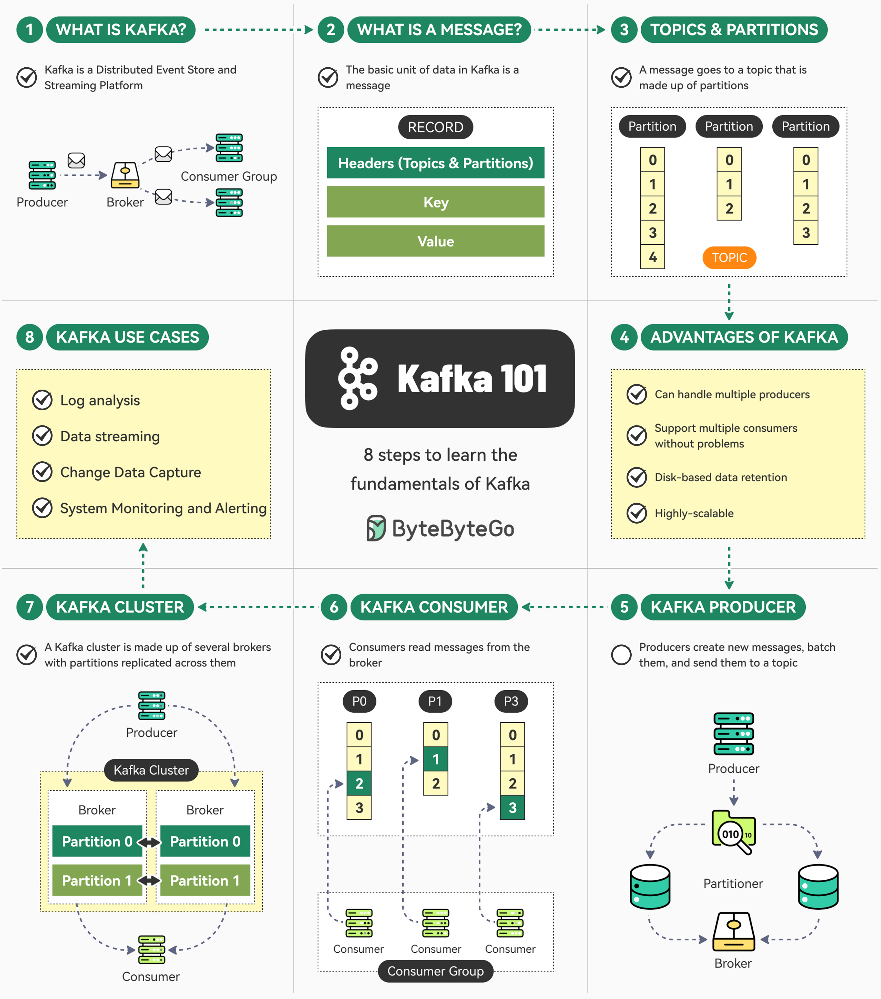

# 📨 Kafka入门8步走！从零搞懂消息队列之王

> Netflix、Uber都在用的分布式流平台

Kafka 很强大但入门有点懵？8步帮你搞懂基础 👇

📌 **1. Kafka是什么？**
分布式事件存储和流处理平台，LinkedIn内部项目起步，现在Netflix、Uber都在用

📌 **2. 消息（Message）**
Kafka的基本数据单元，包含 Header、Key、Value

📌 **3. Topic和Partition**
消息发到特定Topic（像文件夹），Topic有多个分区

📌 **4. Kafka的优势**
支持多生产者/消费者、磁盘持久化、高扩展性

📌 **5. 生产者（Producer）**
创建消息，批量发送到Topic，负责跨分区的消息均衡

📌 **6. 消费者（Consumer）**
以消费者组的形式从Broker读取消息

📌 **7. 集群（Cluster）**
多个Broker组成集群，分区跨Broker复制，保证高可用

📌 **8. 使用场景**
日志分析、数据流处理、CDC（变更数据捕获）、系统监控

💡 Kafka 是后端工程师的必备技能，建议从这8个概念入手，再逐步深入。

你用 Kafka 做过什么项目？👇

---

#Kafka #消息队列 #分布式 #后端 #系统设计 #数据流 #面试
