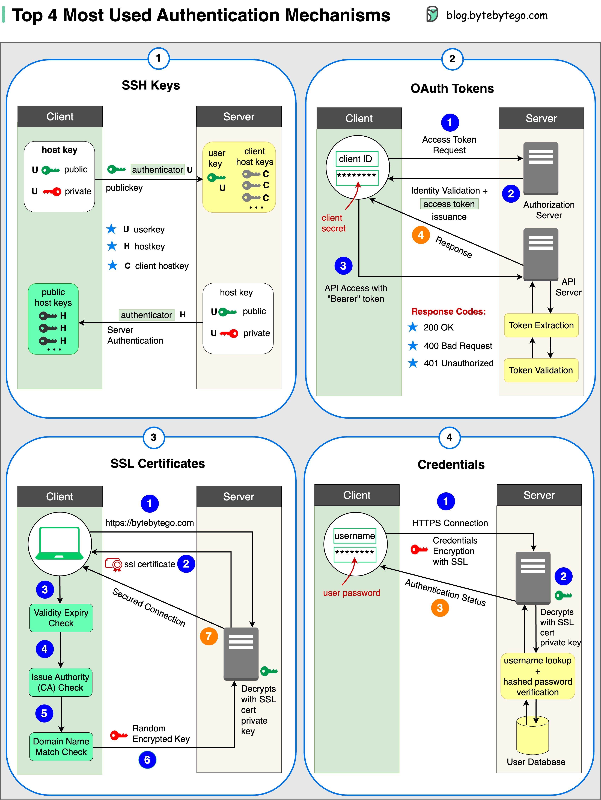

# 🔐 4种主流认证机制！SSH、OAuth、SSL、凭证

> 不同场景用不同的认证方式

安全认证有多种形式，4种最常用的 👇

📌 **SSH Keys** — 用加密密钥安全访问远程系统和服务器
📌 **OAuth Tokens** — 令牌授权第三方应用有限度地访问用户数据
📌 **SSL Certificates** — 数字证书确保服务器和客户端之间的加密通信
📌 **Credentials** — 用户名密码等凭证信息，验证并授予访问权限

💡 千万别把密钥放到 GitHub 仓库里！用专门的密钥管理工具（如 Vault、AWS Secrets Manager）来管理。

你是怎么管理安全密钥的？👇

---

#认证 #SSH #OAuth #SSL #安全 #后端 #程序员
