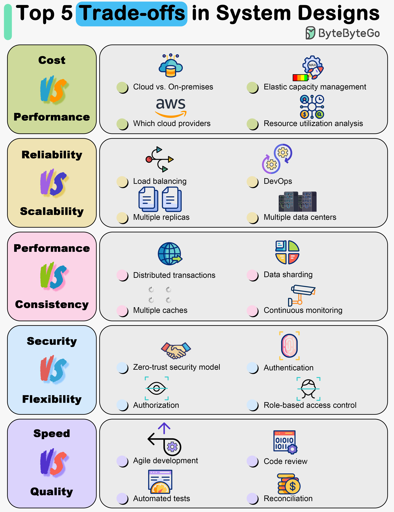

# ⚖️ 系统设计5大权衡！没有完美方案只有最优折中

> 一切都是取舍，一切都是妥协

系统设计没有对错之分，只有权衡 👇

📌 **成本 vs 性能** — 花更多钱能买到更好的性能，但预算有限
📌 **可靠性 vs 扩展性** — 高可靠往往意味着更复杂的架构，扩展更难
📌 **性能 vs 一致性** — 强一致性会牺牲性能，最终一致性更快但有延迟
📌 **安全 vs 灵活性** — 安全措施越多，系统越不灵活
📌 **开发速度 vs 质量** — 快速上线可能牺牲代码质量，高质量需要更多时间

💡 面试时展示你理解这些权衡，比给出"正确答案"更重要。好的架构师知道在哪里妥协。

你在项目中做过最难的权衡是什么？👇

---

#系统设计 #架构 #权衡 #面试 #后端 #分布式 #程序员
