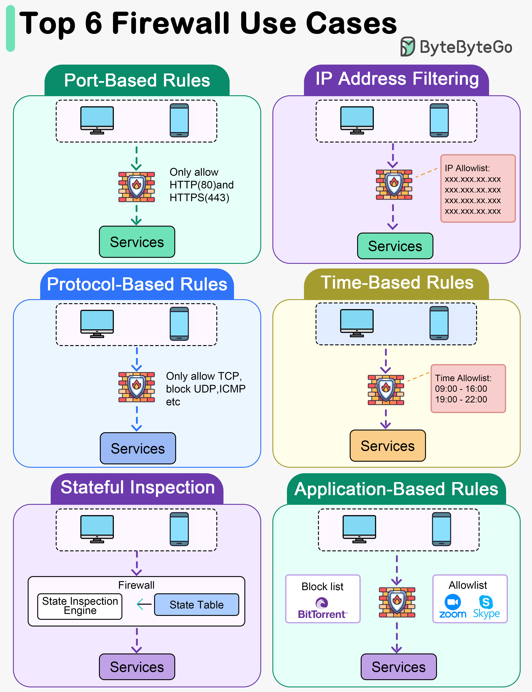

# 🔥 防火墙的6大使用场景！网络安全第一道防线

> 端口规则、IP过滤、协议控制、状态检测……

防火墙是网络安全的基础，6种常见用法 👇

📌 **端口规则** — 只允许80（HTTP）和443（HTTPS）端口的流量
📌 **IP地址过滤** — 白名单放行可信IP，黑名单拦截恶意IP
📌 **协议规则** — 按TCP/UDP/ICMP等协议允许或拦截流量
📌 **时间规则** — 按时间段设置不同的访问规则（工作时间vs下班后）
📌 **状态检测** — 监控活跃连接状态，只允许匹配已建立连接的流量
📌 **应用规则** — 按应用级别控制，比如允许或限制Skype、BitTorrent

💡 防火墙规则要遵循最小权限原则：默认拒绝，只开放必要的端口和服务。

你配置过防火墙规则吗？👇

---

#防火墙 #网络安全 #安全 #运维 #后端 #DevOps #面试
